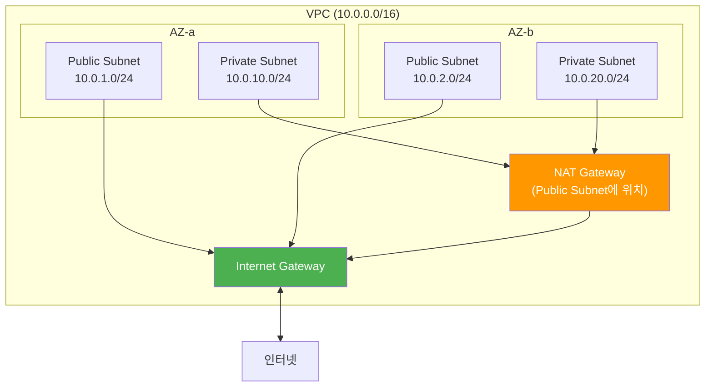
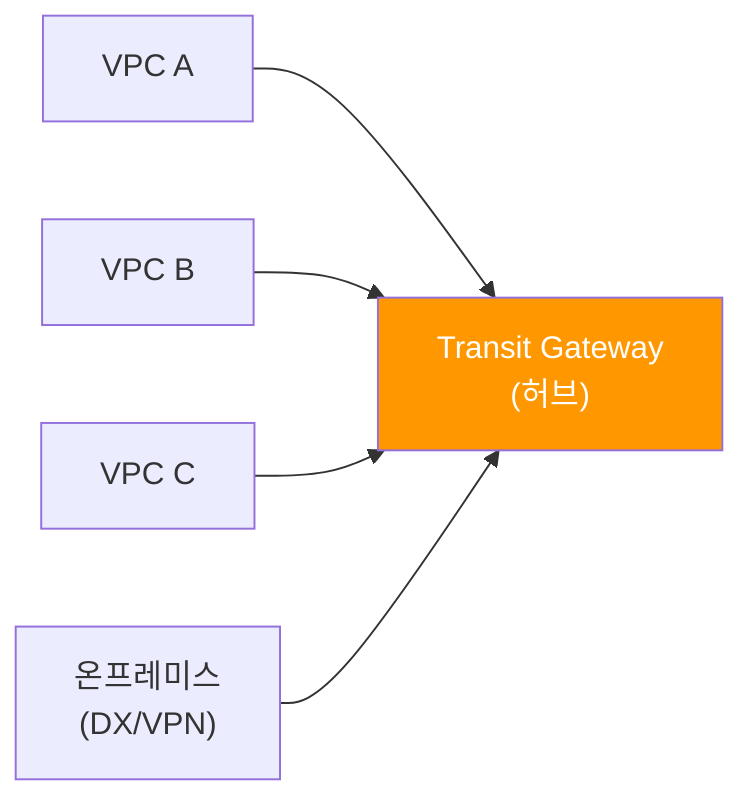
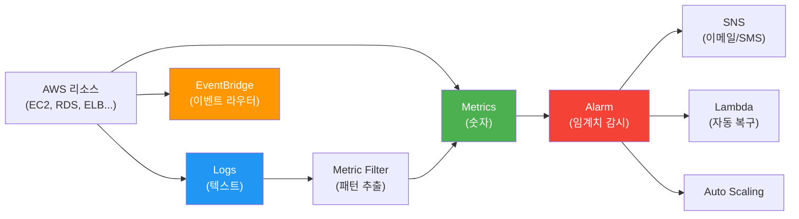

# W3. VPC & Monitoring (VPC, CloudWatch, CloudTrail & Config)

---

## 1. Amazon VPC (Virtual Private Cloud)

### 1.1 VPC란?

💡 AWS는 한 데이터센터를 여러 고객이 공유하는데, 다른 고객의 트래픽이 내 EC2에 닿으면 안 된다. 그래서 AWS는 계정별·논리적으로 격리된 가상 네트워크를 제공하는데 이것이 VPC.

- AWS 계정 전용 가상 네트워크 서비스
- VPC 안에서 EC2/RDS/ELB 같은 리소스를 시작할 수 있고, 다른 가상 네트워크와 논리적으로 분리됨
- S3, CloudFront 같은 글로벌 서비스는 VPC 밖에 존재 (비 VPC 서비스) → VPC Endpoint로 연결 (1.8절)
- 리전마다 VPC를 다수 생성 가능
- 한 VPC는 하나의 사설 IP 대역을 가지며, 그 안에서 서브넷으로 쪼개어 할당

#### VPC CIDR 규칙
(1) AWS가 허용하는 VPC 한 개의 크기: `/16` (IP 65,536개) ~ `/28` (IP 16개)

(2) 💡 권고하는 사설 IP 풀 (RFC 1918에서 사설용으로 예약된 대역) — 이 안에서 (1)의 크기만큼 잘라 VPC를 만든다:
- `10.0.0.0/8` (10.0.0.0 ~ 10.255.255.255, 약 1,677만 개)
- `172.16.0.0/12` (172.16.0.0 ~ 172.31.255.255, 약 104만 개)
- `192.168.0.0/16` (192.168.0.0 ~ 192.168.255.255, 65,536개)

즉 "VPC가 `/8`이 된다"가 아니라, `/8` 풀 안에서 `/16 ~ /28` 크기로 잘라 쓴다는 뜻. 예: `10.0.0.0/8` 풀에서 `10.0.0.0/16`, `10.1.0.0/16`, `10.2.0.0/24` 같은 식으로 여러 VPC를 만들 수 있음.

#### 💡 다른 AWS 고객과 사설 IP가 겹쳐도 되는 이유

- 사설 IP는 인터넷에서 라우팅되지 않는 내부망 전용 주소 (RFC 1918) → 외부에서 직접 접근 불가
- AWS는 각 계정의 VPC를 논리적으로 완전히 격리 → 다른 고객이 같은 `10.0.0.0/16`을 써도 서로의 트래픽이 닿을 수 없음
- 따라서 1,677만 개는 AWS 전체가 나눠 쓰는 풀이 아니라, 각 고객이 독립적으로 자기 VPC 안에서 사용하는 풀
- 단, VPC 간 연결 시(VPC Peering, Transit Gateway, Site-to-Site VPN, Direct Connect)에는 두 VPC의 CIDR이 겹치면 라우팅이 모호해지므로 겹치지 않게 계획해야 함 → 회사 내부에서 VPC를 여러 개 만들 때 CIDR 설계가 중요



### 1.2 Subnet

- VPC 내에 생성되는 분리된 네트워크. 하나의 서브넷은 하나의 AZ에 연결 (AZ 정의는 1주차 1.1)
- VPC가 가진 사설 IP 범위 내에서 서브넷으로 쪼개어 사용
- 실제 리소스는 서브넷에서 생성되며 사설 IP를 기본 할당받음. 필요 시 공인 IP도 할당 가능
- 하나의 서브넷은 하나의 라우팅 테이블과 하나의 NACL (Network ACL)을 가짐
- Public Subnet과 Private Subnet의 구분:
  - Public Subnet: 라우팅 테이블에 인터넷 게이트웨이로의 경로(`0.0.0.0/0 → IGW`)가 있는 서브넷
  - Private Subnet: 그런 경로가 없는 서브넷
- 각 서브넷의 CIDR 블록에서 5개 IP는 예약되어 사용자가 쓸 수 없음. 예: 서브넷이 `172.16.1.0/24`일 때
  - `172.16.1.0`: 네트워크 주소 (Network ID)
  - `172.16.1.1`: VPC 라우터용 (Gateway)
  - `172.16.1.2`: DNS 서버 IP
  - `172.16.1.3`: 향후 사용 예약
  - `172.16.1.255`: 브로드캐스트 주소 (단, VPC는 브로드캐스트 미지원)

### 1.3 ENI (Elastic Network Interface)

💡 EC2의 가상 랜카드. 사설 IP, 공인 IP, MAC 주소, Security Group이 ENI에 묶여 있다. EC2가 외부와 주고받는 모든 트래픽은 ENI를 거침.

- ENI는 특정 서브넷에 귀속됨 → 한 AZ에 묶임
- 한 EC2에 여러 ENI 부착 가능
- 💡 ENI는 EC2와 별개의 독립 리소스 → 떼어서 다른 인스턴스에 재부착 가능. EC2가 죽었을 때 ENI(IP·SG 그대로)를 예비 인스턴스에 옮겨 붙여 동일 주소로 즉시 복구하는 Failover에 활용

### 1.4 Routing Table

💡 서브넷 안의 EC2가 패킷을 보낼 때 "이 목적지 IP는 어디로 보내야 하지?"를 결정하는 규칙표.

라우팅 테이블 예시:

| Destination | Target | 의미 |
|----|----|----|
| `10.0.0.0/16` | `local` | VPC 내부 통신 (자동 추가, 삭제 불가) |
| `0.0.0.0/0` | `igw-xxx` (IGW) | 그 외 모든 트래픽은 인터넷으로 |

- VPC CIDR `local` 항목은 자동 생성됨 → VPC 내부 통신은 항상 보장
- `0.0.0.0/0` (Default Routing): 위에서 매칭 안 된 모든 트래픽이 갈 곳 — 보통 IGW 또는 NAT Gateway
- 1 서브넷 = 1 라우팅 테이블. 하지만 1 라우팅 테이블 → N 서브넷 연결 가능
- Target으로 추가 가능: IGW, NAT Gateway, VPC Endpoint, VPC Peering, Transit Gateway 등

💡 **Public vs Private Subnet의 차이는 결국 라우팅 테이블**:
- Public: `0.0.0.0/0 → IGW` 경로가 있는 서브넷
- Private: 그 경로가 없는 서브넷 (외부 통신이 필요하면 `0.0.0.0/0 → NAT Gateway`)

### 1.5 Internet Gateway / Egress-only IGW

Internet Gateway:
- VPC 내 리소스가 외부 인터넷을 사용할 때 쓰는 게이트웨이. VPC당 1개만 부착 가능
- IGW가 없으면 외부 인터넷 사용 불가
- IGW를 생성한 뒤 라우팅 테이블에 `0.0.0.0/0 → IGW`로 잡아야 사용 가능
- IGW가 있어도 VPC 내 리소스가 공인 IP를 가지지 않으면 인터넷 사용 불가
- 위 설정을 다 했는데도 안 되면 Security Group과 Network ACL을 점검

Egress-only Internet Gateway:
- IPv6를 보유한 VPC 내 인스턴스가 외부 인터넷으로 아웃바운드만 통신할 수 있게 하는 기능
- 아웃바운드 통신만 가능 (외부에서 들어오는 트래픽 차단)
- Network ACL을 통해 제어 가능
- 💡 IPv4의 NAT Gateway에 해당하는 역할을 IPv6에서 수행

### 1.6 NAT Gateway / NAT Instance

💡 Private Subnet에 있는 EC2가 OS 보안 패치 다운로드처럼 외부 인터넷에 접근해야 할 때, 외부에서는 그 EC2에 접근하지 못하게 하면서 안에서만 나갈 수 있도록 중계해주는 장치가 NAT.

NAT Gateway:
- 외부에서의 접촉이 차단된 Private Subnet에서 인터넷에 나가야 할 때 사용
- VPC 내부 → NAT Gateway → 인터넷 방향만 가능. 외부에서 NAT Gateway를 통해 VPC 안으로 들어올 수 없음
- 💡 인터넷에 연결된 Public Subnet에 NAT Gateway를 생성한 뒤, Private Subnet의 라우팅 테이블에 `0.0.0.0/0 → NAT Gateway`로 잡아주면 사용 가능
- AZ 단위 리소스 — 💡 고가용성을 원하면 각 AZ마다 NAT Gateway를 두어야 함. 한 NAT Gateway에 다 몰면 그 AZ가 죽으면 다른 AZ의 EC2도 인터넷이 끊김
- 대역폭 최대 45Gbps까지 자동 확장
- 보안 그룹 사용 불가, NACL로만 트래픽 제어
- CloudWatch로 모니터링 가능

NAT Instance (비권장 — 레거시):
- NAT Gateway 대신 EC2 인스턴스를 사용하는 방식
- 사용자가 직접 관리해야 하고, 인스턴스이므로 장애 발생 시 Failover 스크립트가 필요
- 보안 그룹을 적용할 수 있어 트래픽 세밀 제어는 가능
- SrcDestCheck 속성을 비활성화해야 함

NAT Gateway vs NAT Instance:

| 항목 | NAT Gateway | NAT Instance |
|----|-----------|------------|
| 관리 | AWS 관리형 | 사용자 직접 관리 |
| 가용성 | AZ 내 자동 고가용성 | 직접 Failover 스크립트 필요 |
| 대역폭 | 최대 45Gbps | 인스턴스 유형에 따라 다름 |
| 보안 그룹 | 사용 불가 | 사용 가능 |
| NACL | 사용 가능 | 사용 가능 |

💡 시험에서 "NAT 인스턴스를 어떻게 대체할까?" → 다른 AZ의 NAT Gateway로 교체가 정답.

### 1.7 Security Group vs Network ACL

💡 둘 다 가상 방화벽이지만 적용 범위와 동작 방식이 다르다. 시험에서 단골 출제.

트래픽 통과 순서: 외부 → NACL(서브넷 입구) → Security Group(인스턴스 입구) → EC2

💡 비유: 회사 건물의 이중 보안

```
[방문자]
   │
   ▼
🏢 건물 1층 경비실 (NACL)
   - 블랙리스트로 특정인 입구에서 차단 (Deny 가능)
   - "악성 IP는 건물에 못 들어옴"
   │
   ▼
🚪 각 사무실 문 자물쇠 (SG)
   - 사무실마다 다른 출입카드
   - "DB 사무실에는 웹서버만 들어올 수 있음"
   │
   ▼
[직원 = EC2]
```

- 경비실(NACL): 건물 전체 입구를 지킴. 블랙리스트로 특정인을 한 번에 막음. 하지만 어느 사무실로 갈지는 신경 안 씀
- 사무실 자물쇠(SG): 각 사무실(EC2)마다 다른 출입 권한. 하지만 블랙리스트(특정인 차단)는 못 만듦
- 둘 다 있어야 모든 시나리오를 커버 — 한쪽이 못 하는 걸 다른 쪽이 채움 (이중 방어)

| 항목 | Security Group | Network ACL |
|------|---------------|-------------|
| 적용 대상 | 인스턴스 (ENI) | 서브넷 |
| 상태 추적 | Stateful (응답 자동 허용) | Stateless (인/아웃 모두 규칙 필요) |
| 허용 규칙 | Allow만 | Allow + Deny |
| 평가 | 모든 규칙 OR로 평가 | 번호 순서대로 첫 매칭 |
| 기본 규칙 | Inbound 거부 / Outbound 허용 | Default NACL: 전부 허용 (새로 만들면 전부 거부) |
| 인스턴스당 한도 | 최대 5개 | 서브넷당 1개 |

Security Group 핵심:
- VPC 내 인스턴스에 대한 인바운드/아웃바운드 트래픽을 제어하는 가상 방화벽
- 인스턴스 수준에서 작동 → 같은 서브넷의 인스턴스도 다른 SG를 가질 수 있음
- 기본: 모든 인바운드 거부, 모든 아웃바운드 허용
- Stateful이라 인바운드로 들어온 트래픽의 응답은 아웃바운드 규칙과 무관하게 자동 허용
- 허용 규칙만 존재 (거부 규칙 없음)
- 💡 SG 규칙에 다른 SG를 참조 가능 (예: 웹 SG에서 들어오는 트래픽만 DB SG가 허용) — IP 대신 SG ID로 참조

Network ACL 핵심:
- 서브넷 내부와 외부의 트래픽을 제어하는 가상 방화벽
- 서브넷에 속한 모든 인스턴스가 영향을 받음
- 기본: 모든 인바운드/아웃바운드 허용 (Default NACL 기준)
- Stateless라 인/아웃 양방향에 규칙을 모두 명시해야 함
- 허용/거부 모두 가능 → 💡 특정 악성 IP 차단 같은 Deny는 NACL로만 가능 (SG는 Deny 불가)
- 우선순위 값(번호)이 있으며 작은 값이 먼저 적용

💡 시험 판별:
- "특정 IP를 차단" → NACL (SG는 Deny 불가)
- "인스턴스 단위 세밀 제어" → SG
- "응답이 자동으로 통과" → SG (Stateful)
- "인/아웃 양방향 규칙 모두 필요" → NACL (Stateless)

### 1.8 VPC Endpoint

💡 S3, DynamoDB 같은 글로벌/리전 서비스는 VPC 밖에 있어서 보통 공인 인터넷을 거쳐야 한다. VPC Endpoint를 쓰면 공인 인터넷을 거치지 않고 AWS 내부 백본 네트워크로 연결할 수 있다.

💡 비유: 같은 회사 다른 부서로 서류 보내기
- 일반 통신 (Endpoint 없이): 회사 → 우체국 → 다른 회사 → 우체국 → 같은 회사 (공인 인터넷 경유 — 느리고, 노출 위험, 데이터 전송비 발생)
- VPC Endpoint: 회사 내부 메신저로 직접 전달 (AWS 내부망 경유 — 빠르고, 외부 노출 없음, 비용 절감)

→ 같은 AWS 안의 서비스(S3, DynamoDB 등)인데 굳이 인터넷 밖으로 나갔다 들어올 필요가 없도록 만든 지름길.

경로 비교:
- Endpoint 없이: Private EC2 → NAT Gateway → IGW → 공인 인터넷 → S3 (멀고, 비용·노출)
- Gateway Endpoint: Private EC2 → Gateway Endpoint → S3 (라우팅 테이블에 항목만 추가, 인터넷 안 거침)
- Interface Endpoint: Private EC2 → VPC 안의 ENI(프라이빗 IP) → AWS 서비스 (SQS/KMS 등)

Gateway Endpoint:
- 라우팅 테이블에 항목을 추가하는 방식 — 트래픽을 엔드포인트로 보냄
- 💡 S3와 DynamoDB만 지원
- 무료
- Endpoint Policy로 특정 버킷/액션만 허용 가능

Interface Endpoint (PrivateLink):
- VPC 안에 프라이빗 IP를 가진 ENI를 생성하여 서비스에 연결
- 거의 모든 AWS 서비스 지원 (SQS, SNS, KMS, CloudWatch API 등)
- 💡 시간당 + 데이터 처리량 요금 발생 (유료)
- 온프레미스에서 Direct Connect/VPN을 통해 이 프라이빗 IP로 접근 가능 → 온프레미스 ↔ AWS 서비스 프라이빗 연결

💡 Endpoint Service: 내가 만든 서비스(예: NLB 뒤의 앱)를 다른 VPC에 PrivateLink로 노출. 시험에서 "외부 공급자 VPC의 서비스에 비공개로 연결" 시나리오의 정답.

시험 판별:
- "Private EC2가 S3에 접근, 무료, 인터넷 안 거침" → Gateway Endpoint
- "온프레미스에서 AWS 서비스 프라이빗 접근" → Interface Endpoint
- "다른 VPC의 서비스에 비공개 연결" → PrivateLink (Interface Endpoint Service)

### 1.9 VPC 연결 — Peering, Transit Gateway, VPN, Direct Connect

💡 한 VPC 안에서만 통신하면 되는 경우는 거의 없다. 다른 VPC, 다른 계정, 온프레미스 등과 연결해야 한다. 요구사항(개수·대역폭·지연·암호화)에 따라 4가지 옵션 중 고름.

- VPC ↔ VPC 연결: Peering (1:1) / Transit Gateway (다수 허브)
- VPC ↔ 온프레미스 연결: Site-to-Site VPN (인터넷 경유, 빠른 구축) / Direct Connect (전용선, 고대역·저지연)

VPC Peering:
- 두 VPC 간의 트래픽을 전송하기 위한 1:1 직접 연결
- 다른 리전·다른 계정의 VPC와도 연결 가능 → 요청과 수락 절차가 필요
- 생성 후 라우팅 테이블에 해당 Peering을 추가해야 통신 시작
- CIDR 블록이 겹치면 불가
- 💡 Transit Routing 불가 — 2개의 VPC가 한 개의 중간다리 VPC를 통해 통신할 수 없음. A↔B, B↔C 피어링이 있어도 A→C로 자동 전달 안 됨

Transit Gateway (TGW):
- 여러 VPC와 온프레미스를 중앙 허브로 연결하는 관리형 라우터 (허브 앤 스포크)
- Direct Connect, Site-to-Site VPN도 TGW를 통해 VPC에 연결 가능
- 💡 Virtual Private Gateway는 한 VPC만 연결할 수 있지만 TGW는 다수의 VPC를 한 번에 연결
- 라우팅 테이블 분리, 멀티 리전 피어링 지원
- 💡 시험 단서: "10개 VPC + 본사 + 지사 3곳", "여러 VPC를 단일 허브로 관리" → TGW



Site-to-Site VPN:
- AWS의 IPSec VPN 서비스 — AWS와 온프레미스를 인터넷 경유 IPSec 터널로 연결
- 고객 측 공인 IP(Customer Gateway) + AWS 측 게이트웨이(Transit Gateway 또는 Virtual Private Gateway) 생성 후 터널 구성
- 💡 빠른 구축, 작은 트래픽에 적합. 인터넷 경유라 대역폭/지연이 가변적
- 반드시 터널 쪽으로 라우팅을 생성해야 함

Direct Connect (DX):
- AWS의 전용선 서비스 — 표준 이더넷 광섬유 케이블로 사용자 라우터와 Direct Connect 라우터를 직접 연결
- VPN보다 더 안전·빠른 속도·낮은 지연 보장
- 경로: AWS Region ↔ Direct Connect Location ↔ Customer
- 💡 구축에 수 주 ~ 수개월 소요. 안정성·고대역폭이 필요한 경우 선택
- 💡 DX + VPN 병행(DX 장애 시 VPN 폴백)은 실전 단골 패턴 — DX가 끊기면 자동으로 VPN을 폴백 경로로 사용

시험 판별:
- "1:1 직접 연결, 같은 리전 두 VPC, 비용 효율" → VPC Peering
- "여러 VPC + 온프레미스 중앙 허브" → Transit Gateway
- "빠르게 구축, 인터넷 경유 OK, 암호화 필요" → Site-to-Site VPN
- "고대역폭·저지연·안정성" → Direct Connect

### 1.10 VPC Flow Logs

💡 VPC 안에서 어떤 트래픽이 오갔는지 기록하는 기능. "이 EC2가 왜 DB에 접속 못하지?" 같은 트러블슈팅에 필수.

- VPC / 서브넷 / ENI 단위로 IN/OUT 패킷 메타데이터를 기록
- 형식: 5-tuple (src/dst IP, src/dst 포트, 프로토콜) + 바이트 수 + ACCEPT/REJECT
- 💡 패킷 페이로드(민감 데이터)는 포함되지 않음 — 메타데이터만
- 전송 대상: CloudWatch Logs / S3 / Kinesis Data Firehose
- 💡 Athena로 S3에 저장된 Flow Logs를 SQL로 분석 가능

시험 단서: "VPC 트래픽 흐름을 로깅하여 보안 분석" → VPC Flow Logs

---

## 2. Amazon CloudWatch

### 2.1 CloudWatch란?

💡 EC2, RDS, ELB 같은 리소스가 잘 동작하는지 어떻게 알까? CPU 사용률, 요청 수, 에러 수 같은 지표를 수집·시각화·알람하는 모니터링 허브가 CloudWatch.

- AWS 클라우드 리소스와 애플리케이션을 위한 모니터링 서비스
- 모든 AWS 서비스의 지표가 자동으로 표시되며, 사용자 지정 대시보드로 시각화 가능
- 💡 4가지 핵심 구성요소: Metrics (지표), Logs, Alarms (경보), Events (EventBridge)



### 2.2 Metrics (지표)

- 지표: CloudWatch에 게시된 시간 순서별 데이터 요소 세트 (예: EC2의 CPU 사용량)
- 모니터링 주기:
  - 기본 모니터링: 5분 주기, 자동 활성화, 무료
  - 세부 모니터링 (Detailed Monitoring): 1분 주기, 선택사항, 추가 비용
- EC2 기본 수집 항목: CPU, Network, Disk, Status Check
- 💡 Memory는 기본 메트릭에 없음 — Hypervisor에서 게스트 OS 내부 메모리를 볼 수 없기 때문. CloudWatch Agent로만 수집 가능 (시험 빈출!)
- AWS CLI/API로 사용자 정의 지표 게시 가능 (`PutMetricData` API)

### 2.3 CloudWatch Agent

💡 EC2 기본 메트릭은 Hypervisor가 밖에서 보는 정보(CPU, 네트워크 등)만 수집 가능. OS 내부의 Memory·디스크 사용률은 안 보이므로, OS 안에서 직접 읽어 보내주는 에이전트가 필요 → CloudWatch Agent.

- 수집 대상: Memory, 디스크 사용률, 프로세스 등 기본 메트릭에 없는 항목
- 로그 파일도 CloudWatch Logs로 전송 가능 (예: `/var/log/nginx/access.log`)
- 온프레미스 Linux/Windows 서버에도 설치 가능

→ 시험에서 "EC2의 메모리 사용률 모니터링" → 정답은 항상 **CloudWatch Agent 설치**.

### 2.4 CloudWatch Logs

- EC2 (Agent에서 수집), CloudTrail, Route 53, VPC Flow Logs 등에서 발생한 로그 파일을 모니터링·저장·액세스
- 구조: Log Group → Log Stream → Log Event
  - Log Group: 같은 종류 로그를 모으는 컨테이너 (예: `/aws/lambda/my-func`)
  - Log Stream: Group 안의 개별 소스 (예: 각 EC2 인스턴스, 각 Lambda 호출)
  - Log Event: 타임스탬프 + 메시지 1줄
- 💡 KMS로 암호화 가능, S3로 Export 가능
- CloudWatch Logs Insights: 로그 데이터를 대화식으로 SQL-like 쿼리로 분석

#### 💡 Metric Filter — 텍스트 로그를 숫자 지표로 바꿔 알람을 거는 장치

로그에 "ERROR"라는 단어가 분당 100번 이상 찍히면 알림을 받고 싶을 때 쓰는 기능. CloudWatch Alarm은 "숫자 지표"에만 걸 수 있으므로, 텍스트 로그 → 숫자 카운터로 변환해주는 다리 역할을 한다.

흐름 예: 앱 로그에 "ERROR" 라인 찍힘 → CloudWatch Logs 적재 → Metric Filter가 패턴 매칭해서 `ErrorCount` 메트릭 1 증가 → Alarm이 "1분에 100 초과" 조건 감시 → SNS로 이메일 발송.

### 2.5 Alarm (경보)

- 어떤 지표가 일정 기간 동안 임계값을 초과하면 자동화 작업을 트리거
- 상태: OK / ALARM / INSUFFICIENT_DATA
- 💡 액션: SNS 알림 (이메일/SMS) / Lambda 호출 / Auto Scaling 작업 / EC2 Action(중지·복구·종료·재부팅)
- 💡 Composite Alarm: 여러 알람을 AND/OR로 조합 — "CPU 50% 이상이고 동시에 디스크 IOPS도 높으면" 같은 복합 조건
- 💡 Anomaly Detection: 통계 모델로 평소와 다른 패턴이면 알람 (정적 임계값 대신 ML 기반)

### 2.6 EventBridge (구 CloudWatch Events)

💡 비유: 회사 내부 우편 분류실. AWS 곳곳에서 일어난 일(편지)이 EventBridge로 모이고, 규칙(분류 기준)에 따라 적절한 부서(Lambda, SQS 등)로 자동 전달된다. "S3에 파일이 올라오면 → Lambda 실행" 같은 자동화의 다리 역할.

- AWS 서비스의 이벤트가 사용자 지정 패턴과 일치하거나 일정이 트리거되면 원하는 기능을 발동
- 구성: 이벤트 소스 → 규칙 → 타겟
  - 이벤트 소스: AWS 환경의 이벤트 (예: S3 객체 업로드, EC2 상태 변화)
  - 타겟: 이벤트 발생 시 실행할 대상 (Lambda, SQS, SNS, Step Functions 등)
- 💡 EventBridge Scheduler: cron/rate 표현식으로 정기 실행 (예: 매일 06:00에 배치 Lambda 실행)
- 💡 시험 단서:
  - "S3 업로드 시 자동 처리" → S3 Event → Lambda (또는 EventBridge → Lambda)
  - "매일 정해진 시각에 실행" → EventBridge Scheduler

💡 CloudWatch Synthetics: 카나리 스크립트로 엔드포인트(URL)를 주기적으로 점검 → 사용자가 보기 전에 장애 감지

---

## 3. CloudTrail & AWS Config

💡 두 서비스 모두 거버넌스/감사용이지만 보는 관점이 다르다. CloudTrail은 "누가 무엇을 호출했는가" (API 호출 이력), Config는 "리소스 구성이 어떻게 변했는가" (구성 변화 스냅샷).

| 구분 | CloudTrail | Config |
|----|----------|-------|
| 초점 | "누가" 변경했는가 (API 호출 감사) | "무엇이" 변경됐는가 (구성 스냅샷) |
| 기록 단위 | API 호출 이벤트 | 리소스 구성 항목 (CI) |
| 기본 보관 | 90일 (이벤트 기록) | 활성화한 동안 |
| 규정 위반 평가 | 불가 | Config Rules로 평가 |

### 3.1 CloudTrail

💡 회사 사옥의 RFID 카드 출입기록 같은 것. CloudTrail이 없으면 누가 어떤 버튼을 눌렀는지 영영 알 수 없다.

- AWS 계정 내에서 일어나는 모든 작업과 활동 (API 호출)을 기록하는 서비스
- "누가" 변경을 적용했는지 감시
- AWS 계정 생성 시 자동 활성화, 최대 90일간의 이벤트 기록을 콘솔에서 조회 가능
- 구성: 이벤트 기록 / 추적 (Trail) / Insights 이벤트

추적 (Trail):
- 활성화하면 모든 리전 또는 선택한 리전에 대해 활동 기록을 S3 버킷에 장기 보관 가능 (90일 초과 보관)
- 💡 Organizations와 연동 — 조직 내 모든 계정의 호출을 중앙 버킷에 집계 (Organization Trail)
- CloudWatch Logs로 전송, EventBridge 연동 가능

이벤트 종류:
- 💡 Management Events: 리소스 관리 API (RunInstances, PutBucketPolicy 등). 기본 90일 이벤트 기록 저장
- 💡 Data Events: 데이터 자체 호출 (S3 GetObject, Lambda Invoke 등). 대량·비싸므로 선택적 활성화
- Insights 이벤트: Write API 호출 패턴이 비정상적으로 급증하는 등의 이상을 자동 감지

### 3.2 AWS Config

💡 비유: CloudTrail이 "출입기록부"라면, Config는 "사무실 배치도 사진을 매일 찍어두는 것". CloudTrail로는 "누가 들어와서 책상을 옮겼다"를 알 수 있고, Config로는 "어제는 책상이 여기 있었는데 오늘은 저기로 옮겨져 있다"를 알 수 있다.

- AWS 리소스의 구성 변경에 대한 기록과 변경 알림을 제공
- "무엇이" 변경되었는지 감시
- 💡 Configuration Item (CI): 시점별 리소스 구성 스냅샷 JSON

Config Rules:
- 규칙을 만들어 리소스 구성을 평가하는 기능
- 정해진 규칙을 준수하는지 확인 → 운영자에게 대시보드로 정보 제공
- 종류: AWS 관리형 규칙 / 사용자 지정 규칙 (Lambda 기반)
- 모든 규칙은 변경 트리거 또는 주기적 평가로 설정
- 💡 예시 규칙: "S3 Public Read 금지", "EBS 암호화 필수", "태그 누락 없음"

추가 기능 (💡):
- Remediation: 비준수 시 SSM Automation으로 자동 교정 (예: 퍼블릭 SG를 자동 수정)
- Aggregator: 여러 계정·리전의 Config 데이터를 중앙에서 조회
- Conformance Packs: 규정 세트 묶음(HIPAA, PCI 등)을 한 번에 배포

### 3.3 시험 판별

- "누가 언제 어떤 API를 호출했는가?" → CloudTrail
- "Security Group 규칙이나 S3 Public Access 같은 설정 변경 이력 추적, 규정 위반 자동 감지" → AWS Config
- "여러 계정의 API 호출을 중앙 보관" → CloudTrail Organization Trail + S3
- "여러 계정·리전 Config 데이터 중앙 조회" → Config Aggregator

---

## 4. 핵심 요약 & 시험 포인트

### VPC 핵심

- VPC = 리전 종속 사설 네트워크. 서브넷 = AZ 귀속. CIDR `/16` ~ `/28`
- Public Subnet = 라우팅 테이블에 `0.0.0.0/0 → IGW`. Private Subnet = 그런 경로 없음 (NAT Gateway로 아웃바운드만)
- 서브넷 CIDR에서 5개 IP는 예약 (네트워크/Gateway/DNS/예약/브로드캐스트)
- IGW는 VPC당 1개. 공인 IP가 있어야 외부 통신 가능
- NAT Gateway: 관리형, AZ 단위 → HA 원하면 각 AZ마다 배치. NAT Instance는 비권장 (레거시)
- Egress-only IGW = IPv6용 NAT Gateway (아웃바운드만)
- Security Group: 인스턴스 단위 Stateful Allow만. NACL: 서브넷 단위 Stateless Allow+Deny
- 특정 IP 차단(Deny)은 NACL만 가능
- VPC Endpoint: Gateway(S3/DynamoDB만, 무료) / Interface(거의 모든 서비스, 유료, 온프레미스 접근 가능)
- PrivateLink = Interface Endpoint. 다른 VPC 서비스에 비공개 연결
- VPC 연결: Peering(1:1, 전이 X, CIDR 겹치면 불가) / TGW(허브, 다수 VPC) / VPN(인터넷 IPSec, 빠른 구축) / DX(전용선, 고대역·저지연)
- DX + VPN 폴백은 실전 단골 패턴
- VPC Flow Logs: 5-tuple + 바이트 + ACCEPT/REJECT. CloudWatch Logs / S3 / Firehose 전송. 페이로드는 미포함

### CloudWatch 핵심

- Metric = 시계열 숫자 (그래프/알람용). Log = 텍스트 (검색/분석용). Metric Filter로 Log → Metric 변환
- 기본 모니터링 5분 / 세부 모니터링 1분
- EC2 기본 메트릭에 Memory · Disk 사용률 없음 → CloudWatch Agent로 수집 (시험 빈출!)
- Alarm 상태: OK / ALARM / INSUFFICIENT_DATA. 액션: SNS / Lambda / Auto Scaling / EC2 Action
- Composite Alarm = 여러 알람을 AND/OR로 조합
- Anomaly Detection = 통계 모델 기반 이상 감지
- EventBridge: 이벤트 소스 → 규칙 → 타겟(Lambda/SQS/SNS/Step Functions)
- EventBridge Scheduler = cron/rate 정기 실행 (배치 작업)
- 시험: "S3 업로드 자동 처리" → S3 Event → Lambda. "매일 06:00 배치" → EventBridge Scheduler
- CloudWatch Synthetics = 엔드포인트 주기 테스트

### CloudTrail & Config 핵심

- CloudTrail = "누가 호출했나" (API 호출 감사). 기본 90일. 장기 보관은 S3 Trail
- Management Events vs Data Events: Data Events는 대량/비싸므로 선택적 활성화
- Organization Trail = 조직 전체 계정의 호출을 중앙 S3에 집계
- Config = "구성이 어떻게 변했나" (리소스 구성 스냅샷)
- Config Rules = 정책 준수 여부 지속 평가 (관리형 + 사용자 정의)
- Remediation = 비준수 시 SSM Automation 자동 교정
- Aggregator = 여러 계정·리전 Config 중앙 조회
- 혼동 금지: "누가 호출했나?" → CloudTrail, "구성이 어떻게 변했나?" → Config

### 💡 보안·관찰성 도구 한눈에

| 질문 | 도구 |
|----|----|
| 누가 어떤 API를 호출? | CloudTrail |
| 리소스 구성 변경 이력? | AWS Config |
| 메트릭 임계치 초과 알림? | CloudWatch Alarm |
| 이벤트 기반 자동화? | EventBridge |
| VPC 트래픽 흐름 기록? | VPC Flow Logs |
| 엔드포인트 가용성 주기 점검? | CloudWatch Synthetics |
| 비정상 API 호출 패턴 감지? | CloudTrail Insights |
