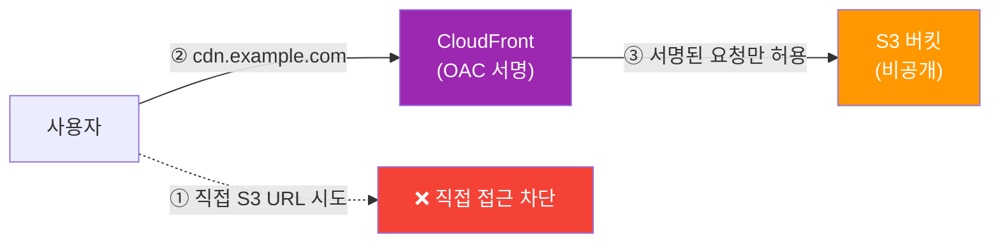
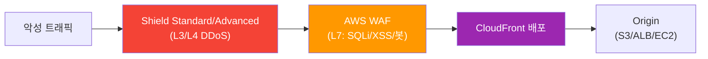
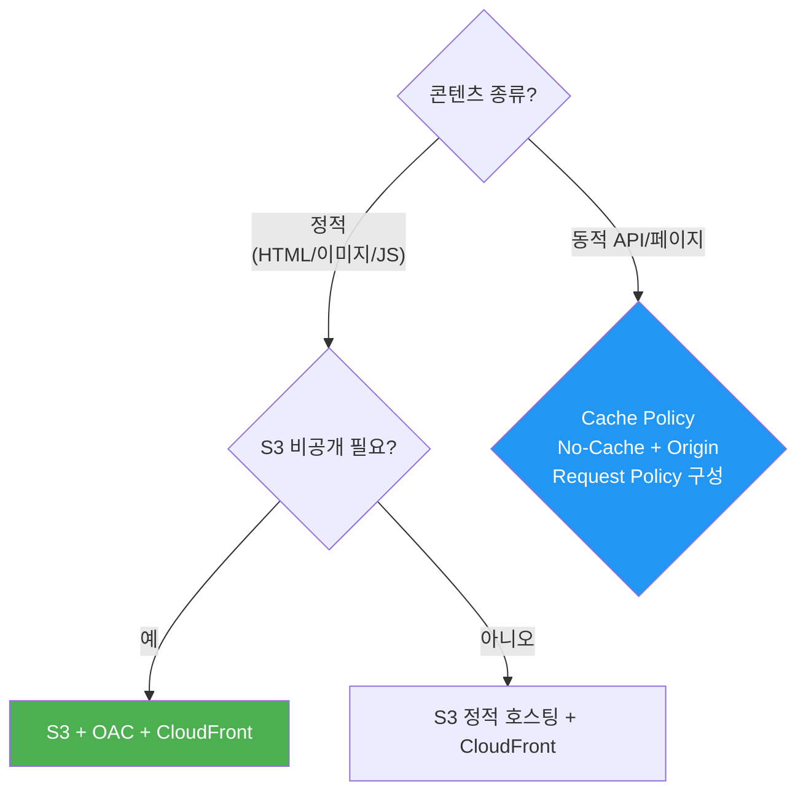
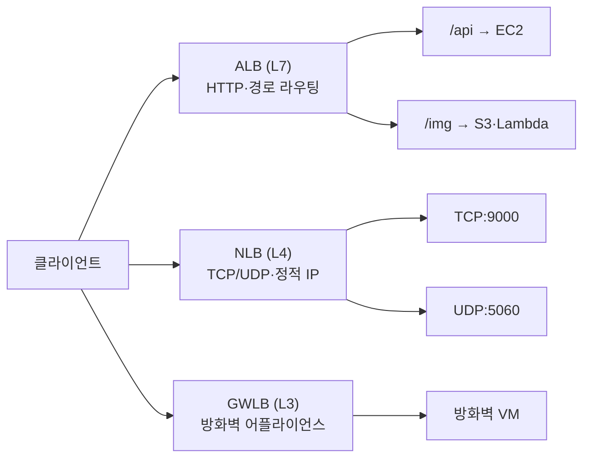
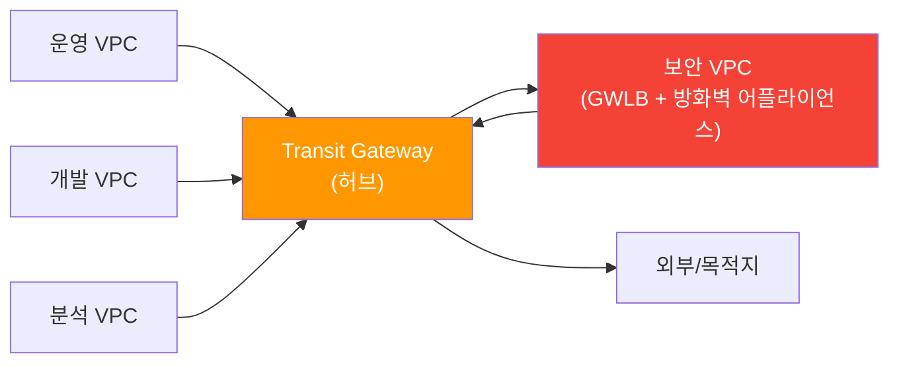
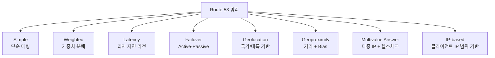
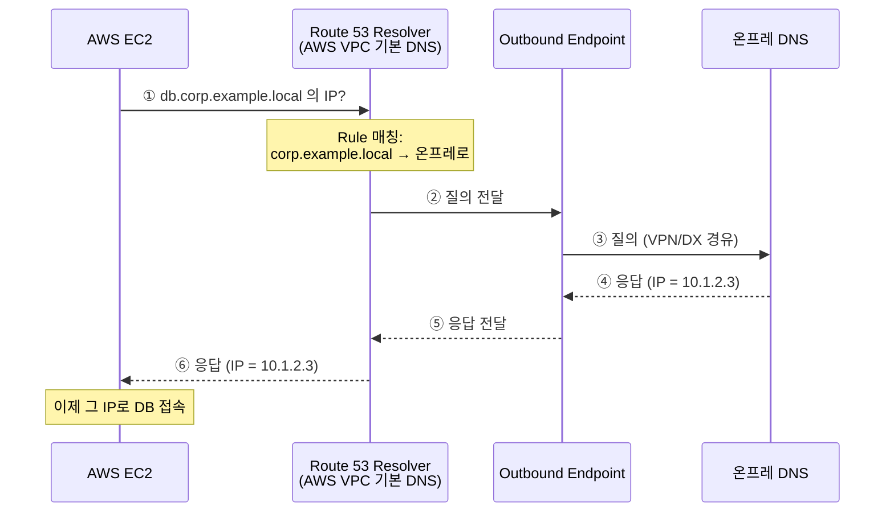
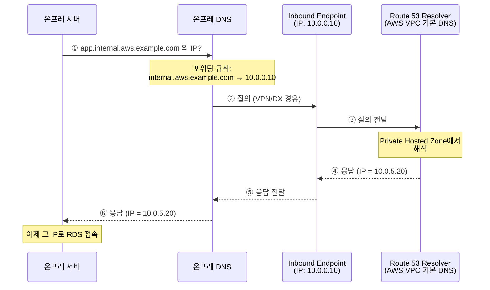
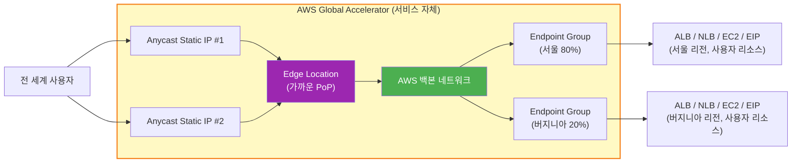

# W4. Traffic (CloudFront, ELB, Route 53, Global Accelerator)

---

## 0. 들어가기 전에 — 계층 모델과 트래픽 4형제

### 0.1 OSI 7계층 (간단히)

💡 4주차 서비스들은 모두 "어느 계층의 트래픽을 다루는가"로 구분된다. 시험 문제도 "TCP/UDP를 가속해야 한다", "HTTP 헤더로 라우팅" 같이 계층을 암시하는 단서를 주는 경우가 많아서, 각 서비스가 OSI 몇 계층인지 매핑해두는 게 핵심.

| 계층 | 이름 | 다루는 것 | 대표 프로토콜·장비 | AWS 서비스 |
|----|----|---------|----------------|--------|
| L7 | Application | 애플리케이션 데이터 (URL, 헤더, 쿠키, HTML) | HTTP, HTTPS, gRPC, WebSocket | CloudFront, ALB, API Gateway |
| L6 | Presentation | 데이터 표현·암호화 | TLS / SSL | ACM (인증서) |
| L5 | Session | 세션 관리 | — | — |
| L4 | Transport | 포트 + 신뢰성 있는 전송 | TCP, UDP | NLB, Global Accelerator |
| L3 | Network | IP 라우팅 (출발지→목적지 IP) | IP, ICMP / 라우터 | GWLB, VPC Routing, Route Table |
| L2 | Data Link | MAC 주소, 같은 네트워크 안 전달 | Ethernet / 스위치 | — (AWS가 추상화) |
| L1 | Physical | 전기 신호·케이블 | 광케이블, UTP | Direct Connect (전용선) |

💡 외우는 팁: 숫자가 높을수록 "똑똑하지만 무겁고", 낮을수록 "단순하지만 빠르다". 그래서 게임·VoIP처럼 지연이 생명인 건 L4(NLB·GA), 웹/API처럼 경로별 분기가 필요한 건 L7(ALB·CloudFront).

#### L4 vs L7 — ALB/NLB 선택의 배경

💡 SAA-C03 시험에 "이건 L4입니까 L7입니까" 같은 OSI 용어 자체가 보기에 그대로 나오는 일은 거의 없다. 대신 시나리오 단서("TCP/UDP 게임 트래픽", "URL 경로별 라우팅" 등)를 주고 ALB/NLB/GWLB 중 무엇을 고를지 묻는다. 그 판단의 배경 지식이 L4/L7.

L4 (Transport) — "포트 번호까지만 본다"
- IP + 포트만 보고 패킷을 전달. 패킷 내용물(HTTP 헤더, URL)은 들여다보지 않음 → 빠름
- 예: TCP:9000 들어오면 그냥 뒤로 보냄. 그게 HTTP인지 게임 프로토콜인지 모름·신경 안 씀
- NLB · Global Accelerator가 L4. 그래서 초저지연·수백만 연결, 대신 "/api 경로면 A로 보내" 같은 건 못 함

L7 (Application) — "내용까지 다 본다"
- HTTP 메시지를 해석해서 URL, Host 헤더, 쿠키, User-Agent까지 확인 → 처리 부담 ↑, 지연 ↑ (그래도 ms 수준)
- 예: `/api/*` → API 서버, `/images/*` → 이미지 서버, Android면 모바일 서버
- ALB · CloudFront가 L7. 경로·헤더 라우팅, WAF 연동, 인증 위임 같은 똑똑한 기능 가능

💡 GWLB는 L3 — IP 패킷을 통째로 어플라이언스(방화벽·IDS)로 투명하게 보내는 용도. 포트/내용 둘 다 안 봄.

> 💡 시험 시나리오 단서 → 서비스 매핑:
> - "TCP/UDP", "초저지연", "고정 IP", "수백만 동시 연결" → **NLB** (또는 글로벌이면 **GA**)
> - "URL 경로", "HTTP 헤더", "쿠키", "Host 기반 라우팅", "WebSocket" → **ALB** (글로벌 캐싱이면 **CloudFront**)
> - "3rd party 방화벽 어플라이언스", "투명 삽입", "GENEVE" → **GWLB**

### 0.2 트래픽 4형제의 역할 분담

💡 시험에서 트래픽 관련 문제는 대부분 "사용자가 전 세계에 있는데 어떤 서비스를 써야 하나?" 형태로 출제된다. 각 서비스가 어느 계층에서 어떤 역할을 하는지를 먼저 머릿속에 정리해두면 시나리오 문제가 빨라진다.

| 서비스 | 계층 | 핵심 역할 | 핵심 키워드 |
|------|-----|--------|----------|
| CloudFront | L7 (HTTP/HTTPS) | 정적·동적 콘텐츠 캐싱 + 글로벌 전송 (CDN) | Edge Location, OAC, Signed URL |
| ELB | L4 / L7 | 한 리전 안에서 여러 EC2에 트래픽 분산 | ALB (L7) / NLB (L4) / GWLB (L3) |
| Route 53 | DNS | 도메인 해석 + 라우팅 정책 | Latency, Failover, Geolocation |
| Global Accelerator | L4 (TCP/UDP) | 글로벌 백본 가속 + 즉시 페일오버 | Anycast Static IP 2개 |

> 💡 한 줄 결정 트리:
> - HTTP/HTTPS + 캐싱 가능 → **CloudFront**
> - TCP/UDP (비 HTTP) 또는 고정 IP 필요 → **Global Accelerator**
> - DNS 라우팅 정책으로 해결 → **Route 53**
> - 한 리전 내 EC2 분산 → **ELB**

---

## 1. Amazon CloudFront

### 1.1 CloudFront란?

💡 서울에 있는 S3 버킷의 이미지를 미국 사용자가 받으려면 서울까지 왕복해야 한다. 거리가 멀수록 지연시간(latency)이 커지고, 같은 파일을 미국·유럽·아시아 사용자가 매번 다시 받으면 원본 S3 부하도 커진다. 사용자와 가까운 지점에 콘텐츠를 미리 캐시해두는 게 CloudFront.

- AWS의 CDN (Content Delivery Network) 서비스
- HTTP/HTTPS로 S3, ALB, EC2, 외부 서버 등의 콘텐츠를 캐시해서 가까운 위치에서 전달
- 전 세계 400개 이상의 Edge Location을 사용 (💡 2026년 기준 600+ PoP까지 확장. 시험 출제 기준은 보통 "400+")
- 캐시 대상 서버를 Origin (원본)이라 부름

💡 비유: 편의점 프랜차이즈 — 본사(Origin, 예: 서울 S3)가 한 곳에 있는데 전국 사용자가 직접 가면 오래 걸린다. 그래서 동네마다 편의점(Edge)을 두고 자주 팔리는 상품(정적 콘텐츠)을 미리 채워둠. 고객이 편의점에 가서 있으면 바로 받고, 없으면 편의점이 본사에 주문(Origin Fetch).

핵심 구성:
- Edge Location: 전 세계 400+ PoP. 사용자와 가장 가까운 곳에서 응답
- Regional Edge Cache: Edge에서 캐시 미스가 났을 때 거치는 중간 계층 → Origin 부하를 더 줄여줌
- Distribution (배포): CloudFront의 작업 단위. 도메인·Origin·캐시 설정 묶음. 생성하면 `xxx.cloudfront.net` 도메인이 발급됨
  - 💡 "배포"는 동사가 아니라 명사 — AWS 공식 한국어 문서가 "Distribution"을 "배포"로 번역. "CDN 인스턴스 한 개" 정도로 이해. 한 계정에 여러 Distribution을 만들 수 있고 각각 도메인·Origin이 다름
  - 💡 발급된 `xxx.cloudfront.net` 도메인은 AWS가 관리하는 DNS에 자동 등록돼 별도 세팅 없이 즉시 사용 가능. 자기 도메인(예: `cdn.example.com`)을 쓰려면 Route 53 Alias 또는 외부 DNS CNAME으로 이 cloudfront.net 도메인을 가리키도록 연결 필요
- Origin 종류: S3 (정적), ALB/NLB·EC2 (동적), 커스텀 HTTP 서버, Lambda Function URL
- Origin Group: 여러 Origin을 1차/2차로 묶어서 Origin Failover (HTTP 5xx/4xx 시 자동 전환). 💡 Route 53 Failover가 DNS 레벨인 반면, Origin Failover는 HTTP 레벨

💡 정적 콘텐츠만 가속한다고 오해하기 쉬운데, 동적 콘텐츠(API 응답 등)도 CloudFront를 거치면 TCP 최적 경로 + TLS Offload 이득이 있음. 단 캐시가 무의미하면 Cache Policy를 No-Cache로 설정.

### 1.2 Cache Behavior / Cache Policy / Origin Request Policy

💡 한 도메인 안에서도 `/images/*`는 S3, `/api/*`는 ALB로 보내고 싶거나, 정적 파일은 1년 캐시·API 응답은 캐시 금지처럼 경로별로 다른 설정이 필요. 이걸 분리해주는 구성이 Behavior.

흐름: Distribution → Behavior (경로별) → Cache Policy & Origin Request Policy

- Cache Behavior: URL 패턴별 설정 (예: `/images/*`는 S3로, `/api/*`는 ALB로, 캐시 정책도 별도)
- Cache Policy: "무엇을 키로, 얼마 동안 캐시할지" 정의 — TTL, 캐시 키(쿼리/헤더/쿠키), 압축 설정
  - 관리형 정책 `CachingOptimized`: Min 1초 / Default 1일 / Max 1년, gzip·br 압축
- Origin Request Policy: Origin으로 전달할 헤더·쿼리·쿠키 (캐시 키와 별개. 캐시는 안 하지만 Origin에는 보내야 하는 정보)
- Response Headers Policy: 응답에 보안 헤더(CSP, HSTS 등) 자동 주입
- Invalidation (캐시 무효화): TTL 만료 전에 특정 경로(`/images/*` 또는 `*`)를 강제로 새로고침. 월 1,000 경로까지 무료

### 1.3 OAI vs OAC — S3 비공개 유지

💡 정적 웹사이트를 CloudFront로 서비스하면서 S3 버킷은 비공개로 유지해야 보안 요구를 충족. 사용자가 CloudFront URL로만 접근하고 S3 URL로 직접 접근하면 차단되도록 하는 설정이 OAC.

- OAI (Origin Access Identity, 레거시): CloudFront에 가상 IAM 사용자를 만들어 S3 버킷 정책에서 그 ID만 허용
  - 한계: SSE-KMS 미지원, PUT/POST/DELETE 미지원
- **OAC (Origin Access Control)** — 권장: 요청에 SigV4 서명을 붙여 S3가 검증
  - SSE-KMS 지원, 모든 HTTP 메서드 지원
  - S3 외에 MediaStore, Lambda Function URL 등도 지원

시험 판별:
- "S3 비공개 유지하며 CloudFront로만 접근" → **OAC** (신규는 OAC 기본, OAI는 레거시)
- 보기에 OAC가 없고 OAI만 있으면 OAI도 정답

### 1.4 접근 제어 — Signed URL / Signed Cookies / Field-Level Encryption

💡 CloudFront는 글로벌 공개가 기본이지만, "결제한 사용자만 동영상 보기", "사내 직원만 접근" 같이 인증이 필요한 경우가 있음.

| 기능 | 한 마디 | 언제 쓰나 |
|----|------|--------|
| **Signed URL** | 파일 1개에 시간 제한 URL 발급 | 단일 PDF 다운로드, 음악 1곡 |
| **Signed Cookies** | 여러 파일에 한 번에 권한 부여 (쿠키) | HLS 영상 스트리밍 (.m3u8 + 수십 개 .ts 세그먼트), 사이트 전체 |
| **Field-Level Encryption** | 특정 필드(카드번호·SSN)를 Edge에서 공개키로 암호화 | PCI/HIPAA 대상 민감 필드 |

> 💡 Signed URL vs S3 Pre-signed URL 혼동 주의:
> - CloudFront Signed URL: CloudFront를 거쳐 콘텐츠에 접근할 수 있는 권한. CDN 가속 + 접근 제어
> - S3 Pre-signed URL: S3 객체에 직접 접근할 수 있는 권한 (2주차 1.12 참고)
> - 시험에서 "CloudFront로 접근 제한" → Signed URL/Cookies / "S3 객체에 직접 임시 접근" → Pre-signed URL

Signed URL 동작:
- CloudFront Key Pair를 계정에 등록
- 만료 시간을 포함한 URL을 서명해서 발급
- 만료 후 또는 IP 제한 위반 시 거부

### 1.5 Geo Restriction / Price Class

Geo Restriction (지리 제한):
- 국가 단위 Allowlist 또는 Blocklist
- 💡 라이선스·규제로 특정 국가에만 콘텐츠 제공 가능할 때 사용 (예: 한국 OTT가 한국 IP만 허용)

Price Class — 💡 비용을 줄이려고 일부 리전의 Edge만 사용하는 옵션. 가격이 비싼 리전(브라질·인도 등)을 빼면 비용 절감, 대신 그 지역 사용자는 멀리 있는 Edge로 라우팅되어 지연시간 증가:
- All: 전체 Edge 사용 (성능 최대, 비용 최대)
- 200: 가장 비싼 리전 제외
- 100: 가장 저렴한 리전만 (미국·유럽 위주)

### 1.6 CloudFront Functions vs Lambda@Edge

💡 사용자의 요청·응답을 Edge에서 가공할 수 있음. 예: 모바일에서 들어온 요청은 모바일 페이지로 리다이렉트, A/B 테스트 헤더 주입, 인증 토큰 검증 등.

| 항목 | CloudFront Functions | Lambda@Edge |
|----|-------------------|------------|
| 런타임 | JavaScript (제한적) | Node.js / Python |
| 실행 시간 | 1ms 이하 (초경량) | 수~수십 ms |
| 발동 위치 | Viewer Request / Viewer Response만 | Viewer + Origin Request / Origin Response |
| Origin 접근 | 불가 | 가능 (다른 AWS 서비스 호출 OK) |
| 비용 | 매우 저렴 | 일반 Lambda 수준 |
| 용도 | URL 재작성, 헤더 조작, 간단한 리다이렉트, A/B 테스트 | 인증·인가, 이미지 동적 변환, Origin 응답 가공 |

시험 판별:
- "가벼운 URL 재작성/헤더 조작" → CloudFront Functions
- "Origin 요청을 변형하거나 외부 호출" → Lambda@Edge

### 1.7 CloudFront + WAF + Shield

💡 자세한 내용은 6주차(Security)에서 다룸. 여기서는 CloudFront와 함께 쓰이는 보안 서비스라는 관점에서 한 줄씩만 정리.

#### AWS WAF (Web Application Firewall, 웹 애플리케이션 방화벽)

- 💡 한 줄: HTTP 요청을 검사해서 악성 트래픽을 차단하는 L7 방화벽
- 차단 대상: SQLi(SQL Injection), XSS(Cross-Site Scripting), 악성 봇, 특정 IP·국가, 레이트 초과(분당 N회 이상 요청)
- 붙는 위치: CloudFront · ALB · API Gateway · AppSync에 직접 연결
- 💡 시험에서 "웹 공격 차단" 시나리오 → 정답은 **WAF**

#### AWS Shield Standard

- 💡 한 줄: L3/L4 DDoS 자동 방어 서비스 (SYN flood, UDP reflection 같은 네트워크 계층 공격)
- 모든 AWS 계정에 무료 자동 적용 — 별도 설정 불필요. CloudFront·Route 53에는 항상 활성화돼 있음
- 시험 단서: "기본 DDoS 보호" → **Shield Standard** (이미 켜져 있음)

#### AWS Shield Advanced

- 💡 한 줄: Shield Standard의 유료 확장판으로, 더 정교한 DDoS 방어 + 전문가 지원
- 비용: 월 3,000 달러 + 데이터 처리 요금 (조직 단위 구독)
- 추가 기능:
  - 보호 대상 확장: ELB · CloudFront · Route 53 · Global Accelerator · EIP
  - SRT (Shield Response Team) 24/7 대응 — DDoS 공격 시 직접 컨설팅
  - 공격으로 인한 트래픽 폭증 요금 환불(**Cost Protection**)
- 시험 단서: "대규모/정교한 DDoS 보호 + 공격 시 요금 보호" → **Shield Advanced**

💡 시험에 자주 나오는 패턴: ALB 앞에 CloudFront를 두고 WAF 연결 → ALB는 비공개 서브넷에 두면서 외부 노출은 CloudFront만, DDoS도 흡수.

| 시나리오 | 정답 |
|--------|----|
| 웹 SQL Injection / XSS 차단 | **WAF** (CloudFront 또는 ALB에 연결) |
| 특정 국가/IP 차단 | WAF 또는 CloudFront Geo Restriction |
| 분당 요청 수 제한 (Rate Limit) | **WAF Rate-based Rule** |
| 일반 DDoS 자동 방어 (이미 켜져 있음) | **Shield Standard** |
| 정교한 DDoS + 전문가 지원 + 요금 보호 | **Shield Advanced** |
| L7 공격 + L3/L4 DDoS 동시 방어 | **WAF + Shield**

### 1.8 CloudFront 핵심 시험 포인트

| 시나리오 | 정답 |
|--------|----|
| 전 세계에 S3 정적 콘텐츠 최소 지연 | CloudFront + S3 + OAC |
| 로그인한 사용자만 영상 접근 | Signed URL / Signed Cookies |
| HLS 영상 스트리밍 권한 부여 | Signed Cookies (여러 파일) |
| 단일 PDF 다운로드 임시 권한 | Signed URL (1개 파일) |
| 동적 API도 가속 | Cache Policy = No-Cache + Origin Request Policy |
| S3 비공개 + CloudFront로만 접근 | OAC (또는 OAI) |
| 특정 국가만 허용/차단 | Geo Restriction |
| 캐시 즉시 갱신 | Cache Invalidation |
| 카드번호 필드만 암호화 | Field-Level Encryption |
| Origin 장애 시 자동 전환 (HTTP 레벨) | Origin Group / Origin Failover |

---

## 2. Elastic Load Balancer (ELB)

### 2.1 ELB란?

💡 여러 EC2를 띄워도 사용자가 한 EC2의 IP만 안다면 그쪽만 부하가 몰리고 그 EC2가 죽으면 서비스가 끊김. 클라이언트는 ELB 하나의 DNS만 알고, ELB가 뒤의 정상 EC2로 요청을 나눠주면 부하 분산 + 자동 페일오버가 됨.

- AWS의 L4 / L7 로드밸런싱 서비스
- 한 리전 안의 여러 AZ에 걸쳐 EC2/컨테이너/Lambda/IP에 트래픽을 분산
- VPC 내부에 존재. Internet-facing (공인) 또는 Internal (사설) 두 종류
- 상태 검사 (Health Check): 비정상 타겟은 자동 제외 — Auto Scaling과 결합해 자동 복구
- SSL/TLS 인증서를 ELB에 등록해 HTTPS 복호화를 대신 처리 (**SSL Offload**) → EC2의 CPU 부담 절감

💡 비유: 우편·택배·고속도로
- ALB는 "편지를 주소·이름 보고 분류하는 우체국 (L7)"
- NLB는 "박스 크기만 보고 빨리 옮기는 택배 (L4)"
- GWLB는 "고속도로 톨게이트 (L3)" — 모든 차량을 검문소(방화벽)로 한 번 보냈다가 통과시킴

### 2.2 ALB / NLB / GWLB 비교

| 구분 | ALB (L7) | NLB (L4) | GWLB (L3) |
|----|--------|--------|---------|
| 프로토콜 | HTTP / HTTPS / gRPC / WebSocket | TCP / UDP / TLS | IP (GENEVE) |
| 라우팅 기준 | 경로 · 호스트 · 헤더 · 쿼리 | 포트 · 단순 분배 | 투명 삽입 |
| 정적 IP | 없음 (도메인만, 동적 IP) | AZ당 1개 고정 IP / EIP 지정 가능 | 없음 |
| Source IP | ALB Private IP로 변경 (X-Forwarded-For로 전달) | 클라이언트 IP 그대로 보존 | 그대로 |
| 타겟 | EC2 · IP · Lambda · 컨테이너 | EC2 · IP · ALB | 어플라이언스 VM |
| 대표 용도 | 웹·API·마이크로서비스 | 게이밍·IoT·금융 (저지연·고정 IP) | 3rd party 방화벽·IDS 체인 |

### 2.3 Application Load Balancer (ALB)

- L7 HTTP(S) 로드밸런서. URL 경로·호스트·헤더·쿠키·쿼리까지 보고 어느 Target Group으로 보낼지 결정
- 리스너 규칙 (Listener Rule): 우선순위 + 조건 (path/host/header) + 동작 (forward / redirect / fixed-response)
- 💡 예: `/api/*` → API 서버 그룹, `/images/*` → 이미지 서버 그룹, User-Agent에 `Android` → 모바일 서버 그룹
- Sticky Session (고정 세션): 같은 사용자를 계속 같은 EC2로 보냄 (애플리케이션 쿠키 또는 Duration 기반)
- SSL Offload: ACM 인증서를 ALB에 붙여 HTTPS 복호화 대신 처리
- WebSocket / HTTP/2 / gRPC 지원
- Cognito·OIDC로 사용자 인증 위임 가능 — 💡 앱 코드를 안 건드리고도 ALB가 로그인 처리
- 💡 트래픽이 ALB를 통과하면 Source IP가 ALB Private IP로 변경 → 원본 클라이언트 IP는 `X-Forwarded-For` 헤더로 전달

### 2.4 Network Load Balancer (NLB)

- L4 초고성능 로드밸런서. 밀리초 이하 지연, 초당 수백만 동시 연결
- TCP / UDP / TLS 기반. 💡 ALB는 HTTP(S)만 가능하므로 게임 서버(UDP)나 VoIP는 NLB
- AZ당 **정적 IP** 1개 (또는 EIP 지정 가능) — 💡 ALB와 달리 IP가 고정. 방화벽 화이트리스트로 고정 IP만 허용해야 하는 B2B 시나리오에서 NLB가 정답
- 클라이언트 IP 보존: TCP는 NLB가 NAT를 하지 않아서 타겟에 원본 IP가 그대로 보임. UDP의 경우 Proxy Protocol로 전달 가능
- TLS 설정 시 SSL Offload 지원
- PrivateLink Endpoint Service (VPC 서비스 노출)의 프론트엔드로 사용

💡 NLB → ALB 체이닝 — NLB를 앞에 두고 그 뒤에 ALB를 둠. NLB의 고정 IP와 ALB의 L7 라우팅을 동시에 얻고 싶을 때.

### 2.5 Gateway Load Balancer (GWLB)

- L3 투명 로드밸런서. 💡 3rd party 가상 어플라이언스(Palo Alto, Check Point 등 방화벽·IDS·DPI)를 트래픽 경로에 "투명하게" 삽입
- GENEVE 프로토콜(UDP 6081)로 어플라이언스에 패킷을 전달 → 검사 후 돌려받음
- 리스너 포트 불필요 (모든 IP 트래픽 처리)

💡 Transit Gateway + GWLB 중앙 방화벽 허브 패턴

회사가 VPC를 여러 개(운영·개발·분석 등) 운영할 때, 모든 VPC 트래픽을 방화벽으로 검사하려면:
- 각 VPC마다 GWLB + 방화벽을 따로 두면 비용·관리 부담 큼
- 대신 "**보안 전용 VPC**"를 하나 만들고 거기에만 GWLB + 방화벽을 배치한 뒤, Transit Gateway(다수 VPC를 잇는 허브, 3주차 1.9 참고)로 모든 다른 VPC의 트래픽을 보안 VPC로 끌어와 검사

시험 단서: "여러 VPC + 중앙 보안 검사 + 3rd party 방화벽" → **TGW + GWLB**

### 2.6 Target Group / Health Check / 부가 기능

Target Group (대상 그룹):
- ELB에 등록되는 타겟들(EC2/IP/Lambda/컨테이너)의 묶음
- 헬스체크 방법(HTTP·HTTPS·TCP), 주기·임계치를 정의
- Sticky Session, Cross-Zone Load Balancing 등 속성을 여기서 설정

#### Cross-Zone Load Balancing (교차 영역 로드 밸런싱) — 💡 시험 빈출

- 기본 동작 (OFF일 때): ELB는 AZ별로 50:50 같은 비율로 트래픽을 보냄 → A AZ에 EC2 2대, B AZ에 EC2 8대면 A의 EC2가 4배 부하
- 켜면: AZ가 아니라 EC2 개수 기반으로 분산 → 모든 EC2에 고르게
- ALB: 항상 ON
- NLB · GWLB: 기본 OFF (켜면 AZ 간 데이터 전송 요금 발생)

> 참고 — ALB Cross-Zone의 LB 레벨과 Target Group 레벨 (시험 범위 밖)
> 정확히는 ALB는 "LB 레벨에서 항상 ON, 특정 Target Group 레벨에서만 OFF로 재정의 가능". ALB는 여러 Target Group(예: `/api/*` → API-TG, `/img/*` → IMG-TG)을 가질 수 있는데, LB 전체 기본은 ON이지만 특정 TG 하나만 별도 OFF 가능하다는 의미. SAA-C03 시험에서는 "ALB는 항상 ON" 정도로 충분.
> 참고: https://docs.aws.amazon.com/elasticloadbalancing/latest/application/edit-target-group-attributes.html

#### X-Forwarded-For

- ALB는 Source IP를 자기 IP로 바꾸므로 EC2에서 원본 클라이언트 IP를 알려면 `X-Forwarded-For` HTTP 헤더 확인
- NLB는 IP를 보존하므로 헤더 없이도 원본 IP가 보임

#### Connection Draining = Deregistration Delay

💡 같은 기능의 다른 이름. Classic Load Balancer 시절 이름은 Connection Draining, ALB/NLB의 현재 이름은 Deregistration Delay. 시험 보기에는 둘 중 어떤 이름으로도 나올 수 있음.

기능: EC2가 ELB에서 빠질 때(스케일 다운·배포 교체·헬스체크 실패), 그 EC2가 처리 중이던 요청을 안전하게 끝낼 수 있도록 유예 시간을 두는 것.

동작 흐름:
1. EC2를 ELB에서 빼라는 신호 발생 (Auto Scaling이 종료 결정 등)
2. ELB가 그 EC2를 신규 트래픽 대상에서 즉시 제외 → 새 요청은 다른 EC2로
3. 이미 진행 중인 요청·세션은 그대로 처리하게 둠
4. 유예 시간(기본 300초, 1~3600초 설정 가능)이 지나거나 모든 세션이 끝나면 EC2 분리 완료

💡 왜 필요한가: 이 기능이 없으면 결제 진행 중인 사용자가 갑자기 "결제 실패"를 보게 되거나, 다운로드 중인 파일이 잘림. 무중단 배포·자동 스케일링의 필수 장치.

시험 단서:
- "ELB에서 EC2 종료 시 진행 중 요청 보호" → **Connection Draining / Deregistration Delay**
- "기본 유예 시간" → 300초

### 2.7 ELB 핵심 시험 포인트

| 시나리오 | 정답 |
|--------|----|
| HTTP(S) + 경로·호스트·헤더 라우팅 | **ALB** |
| 초저지연 + 수백만 TCP 연결 + 고정 IP | **NLB** |
| UDP (게임·VoIP·SIP) | **NLB** |
| 방화벽 화이트리스트에 고정 IP 등록 필요 | **NLB** (또는 NLB + EIP) |
| 3rd party 방화벽 어플라이언스 체인 | **GWLB** + Transit Gateway |
| 고정 IP + L7 라우팅 동시 | **NLB → ALB 체인** |
| 원본 클라이언트 IP가 그대로 필요 | NLB (또는 ALB + X-Forwarded-For) |
| HTTP를 HTTPS로 자동 리다이렉트 | ALB 리스너 규칙 |
| 사용자 인증을 코드 변경 없이 위임 | ALB + Cognito / OIDC |
| AZ 간 EC2 수 불균형인데 부하 균등 분산 | Cross-Zone Load Balancing ON |

---

## 3. Amazon Route 53

### 3.1 Route 53이란?

💡 사용자는 `example.com` 같은 도메인을 입력하지 `52.78.x.x` 같은 IP를 외우지 않는다. 도메인 → IP 변환이 DNS이며, AWS가 제공하는 권위 있는(authoritative) DNS 서비스가 Route 53. 단순 해석을 넘어 "어느 리전으로 / 어떤 비율로 / 어떤 조건으로" 트래픽을 보낼지까지 결정한다.

- 3가지 기능을 모두 제공:
  1. 도메인 등록 (Domain Registration)
  2. DNS 라우팅 (Routing)
  3. Health Check (상태 확인)
- 도메인 등록 비용: 약 12,000원/년 (.com 기준), 최대 3일 소요
- Hosted Zone (호스팅 영역): 도메인의 DNS 레코드 묶음
  - Public Hosted Zone: 인터넷에서 해석 가능
  - Private Hosted Zone: 특정 VPC 내부에서만 해석 (외부 비공개)
- Record Types: A · AAAA · CNAME · Alias · MX · TXT · NS · SOA
- TTL (Time to Live): DNS 캐시 수명, 기본 300초. 짧으면 페일오버 빠름 (쿼리 비용↑), 길면 안정적 (전환 느림)

💡 비유: 스마트 전화 안내원 — 단순 안내 ("그 번호요? 이거예요") 외에 "지금 가장 가까운 지점 알려드릴게요" (Latency), "메인 안 받으면 예비로" (Failover) 같은 이중화 응답.

### 3.2 라우팅 정책 8종 (시험 핵심)

| 정책 | 용도 | 대표 시나리오 |
|----|----|----------|
| Simple | 한 레코드에 지정한 값(들)을 그대로 반환. 헬스체크 없음 | 단순 도메인 매핑 |
| Weighted | 가중치로 분배 | A/B 테스트, 카나리 배포, 신규 버전 10% 점진 노출 |
| Latency | 사용자의 RTT가 가장 낮은 리전으로 | 글로벌 사용자 최저 지연 |
| Failover | Primary가 헬스체크 실패 시 Secondary로 (Active-Passive) | DR (Disaster Recovery), 장애 자동 전환 |
| Geolocation | 사용자 국가/대륙 기반 고정 | 언어별·규정별·지역별 콘텐츠 |
| Geoproximity | 지리적 거리 + Bias (가중치로 영역 확장/축소). Traffic Flow 필요 | 편중 전환이 필요할 때 |
| Multivalue Answer | 여러 정상 IP를 랜덤 반환 + 헬스체크 | 간이 로드 분산 + 비정상 인스턴스 자동 제외 |
| IP-based | 클라이언트 IP CIDR 범위로 분기 | ISP별 최적 경로 지정, 특정 IP 대역만 다른 엔드포인트로 |

> 💡 SAA-C03 시험에서는 통상 앞 7종이 빈출이고 IP-based는 거의 안 나옴. 다만 공식 문서 기준 정책은 총 8종이라는 사실은 알아둘 것.

> 참고 자료 정정 — 라우팅 정책 개수
> 기존 문서에서는 "7종"으로 서술했으나, 정확하게는 AWS 공식 문서 기준으로 8종 (IP-based routing policy 포함). 시험 출제 빈도는 앞 7종이 높으나 공식 분류는 8종임.
> 참고: https://docs.aws.amazon.com/Route53/latest/DeveloperGuide/routing-policy.html

> 💡 Geolocation vs Geoproximity 혼동 주의:
> - Geolocation: 국가/대륙으로 고정 매핑. "한국에서 온 요청은 무조건 서울로". 거리 무관
> - Geoproximity: 사용자-리소스 거리 기반 + Bias로 영역 조정. "서울 리전을 +50% 더 끌어당김". Traffic Flow 기능 활성화 필요

> 💡 Multivalue Answer vs Simple (다중 값을 다루는 두 정책 비교):
> - Simple: 한 레코드에 여러 값을 지정해도 헬스체크 없이 지정한 값을 그대로 응답에 모두 담아 반환. 비정상 IP도 그대로 반환됨. 보통은 단일 값 매핑에 사용
> - Multivalue Answer: 헬스체크와 결합 → 정상 값만 최대 8개 반환. 비정상 인스턴스로 인한 5xx 방지

### 3.3 Alias vs CNAME
#### Alias가 뭔지 — Route 53의 레코드 옵션

Route 53에서 DNS 레코드를 만들 때 타입을 고름:
- A: 도메인 → IPv4
- AAAA: 도메인 → IPv6
- CNAME: 도메인 → 다른 도메인

A/AAAA를 만들 때 **"Alias" 토글**을 선택할 수 있음:
- Alias OFF (일반 A 레코드) → 값으로 IP를 직접 입력 (예: `203.0.113.10`)
- Alias ON → IP 대신 **AWS 리소스를 드롭다운에서 선택** (ALB / CloudFront / S3 정적 웹 / API Gateway 등)

즉 Alias = "A/AAAA 레코드인데 값을 IP가 아니라 AWS 리소스로 채우는 모드". Route 53이 그 리소스의 현재 IP로 자동 해석.

#### Alias vs CNAME 비교

CNAME은 DNS 표준 레코드인데 세 가지 제약이 있어 AWS가 이를 보완한 게 Alias.

CNAME의 한계:
1. 루트 도메인(`example.com`, apex)에 쓸 수 없음 — DNS 표준상 apex에는 SOA·NS 같은 다른 레코드가 반드시 있어야 하는데 CNAME은 다른 레코드와 공존 불가
2. 추가 쿼리 비용 — CNAME으로 받은 도메인을 또 IP로 해석해야 해서 쿼리가 2회
3. Route 53 헬스체크와 결합 불가

Alias는 위 세 가지를 모두 해결. 대신 대상이 AWS 리소스로 제한.

| 도메인 위치 | A 일반 (IP 직접 입력) | A + Alias 토글 ON | CNAME |
|----------|-------|------|----|
| `example.com` (apex) | OK | OK | ❌ DNS 표준 위반 |
| `www.example.com` (서브) | OK | OK | OK |

| 항목 | Alias (별칭) | CNAME |
|----|------------|-------|
| 가리킬 수 있는 대상 | AWS 리소스만 (CloudFront, ALB/NLB, S3 정적 웹, API Gateway, Elastic Beanstalk, VPC Interface Endpoint, 같은 zone 내 다른 Route 53 레코드) | 모든 도메인 (AWS 외부 포함) |
| 루트 도메인 (apex, `example.com`) | 사용 가능 | 사용 불가 (서브도메인만) |
| 비용 | 무료 (Route 53 → AWS 리소스 쿼리) | 일반 DNS 쿼리 요금 |
| Health Check | 지원 | 미지원 |

💡 실제 사용 시나리오:

| 시나리오 | 사용 가능 | 권장 |
|--------|-------|----|
| `example.com` (apex) → ALB | Alias만 | Alias 필수 |
| `www.example.com` → ALB | 둘 다 | Alias (무료 + 헬스체크) |
| `cdn.example.com` → CloudFront | 둘 다 | Alias |
| `tracking.example.com` → 외부 SaaS `analytics.thirdparty.com` | CNAME만 | CNAME (AWS 외부) |
| `mail.example.com` → 외부 메일 호스팅 | CNAME만 | CNAME |

요약: AWS 리소스를 가리키면 거의 항상 Alias, 외부 서비스면 CNAME.

시험 단서:
- "루트 도메인 `example.com`을 ALB로 연결" → **Alias** (CNAME 불가)
- "외부 SaaS 도메인을 가리킴" → CNAME
- "CloudFront/ELB/S3 Website에 도메인 연결, 비용 효율" → Alias

### 3.4 Health Check

- 엔드포인트(IP/도메인) 상태를 TCP/HTTP/HTTPS로 주기적 확인
- 3가지 종류:
  1. 엔드포인트 직접 체크
  2. CloudWatch 알람 상태 연결 (예: 알람이 ALARM이면 비정상으로 간주)
  3. 다른 헬스체크들의 결합 (Calculated Health Check)
- Failover 정책과 결합해 자동 전환의 핵심 역할
- 💡 Multivalue Answer / Failover 정책에 필수

### 3.5 Resolver (Hybrid DNS)

💡 회사가 온프레미스(자체 데이터센터) + AWS를 같이 운영하는 하이브리드 환경에서, 양쪽이 서로의 내부 도메인을 해석해야 할 때 쓰는 기능. VPN 또는 Direct Connect로 네트워크는 연결돼 있어도 DNS는 각자라 도메인 해석이 안 되는 문제를 해결.

#### Route 53 Resolver가 뭔지 먼저

- Route 53 Resolver = VPC마다 자동으로 존재하는 AWS의 기본 DNS 서버. 별도로 만들 필요 없이 VPC를 만들면 그 안의 리소스(EC2 등)는 자동으로 이 Resolver를 통해 도메인을 해석함
- VPC 안에서만 동작 — 그대로는 VPC 밖(온프레)에서 접근하거나 거꾸로 온프레 도메인을 묻는 게 불가
- 이 한계를 해결하는 게 Endpoint (프라이빗 IP를 가진 가상 랜카드, ENI). Resolver를 VPC 밖과 연결하는 게이트 역할
  - Inbound Endpoint: 온프레 → Resolver로 들어오는 질의를 받음
  - Outbound Endpoint: Resolver → 온프레로 나가는 질의를 보냄
- 어느 도메인을 어디로 포워딩할지 정의하는 게 Resolver Rule

💡 구체 시나리오 — 회사가 데이터센터에 기존 도메인 `corp.example.local`을 운영 중, AWS로 일부 워크로드를 마이그레이션.

#### 경우 A — AWS → 온프레 (Outbound Endpoint)

상황: AWS의 EC2 앱이 온프레 DB `db.corp.example.local`에 도메인으로 접속하고 싶음. AWS Resolver는 `corp.example.local` 도메인을 모름.

설정: Outbound Endpoint 생성 + Resolver Rule "`corp.example.local`로 끝나는 질의는 온프레 DNS(`10.1.0.5`)로 포워딩".

#### 경우 B — 온프레 → AWS (Inbound Endpoint)

상황: 온프레 서버가 AWS Private Hosted Zone에 등록된 `app.internal.aws.example.com` (RDS 엔드포인트 등)에 접속하고 싶음. 온프레 DNS는 AWS Private Hosted Zone을 모름.

설정: Inbound Endpoint 생성(VPC 안에 프라이빗 IP, 예: `10.0.0.10` 발급) + 온프레 DNS에 "이 도메인은 그 IP로 포워딩" 규칙.

#### 요약

- Inbound Endpoint: 온프레미스 → AWS VPC DNS (온프레가 AWS 내부 도메인 질의)
- Outbound Endpoint: AWS VPC → 온프레미스 DNS (AWS가 온프레 도메인 질의)
- Resolver Rule로 "특정 도메인은 어디로 포워딩"을 정의
- 양쪽이 서로 질의해야 한다면 두 Endpoint를 각각 생성

시험 단서:
- "온프레가 AWS 프라이빗 도메인 접근" → **Inbound Endpoint**
- "AWS 앱이 온프레 도메인 접근" → **Outbound Endpoint**
- "양방향 + 가장 안전" → 두 Endpoint를 각각 생성

### 3.6 Route 53 핵심 시험 포인트

| 시나리오 | 정답 |
|--------|----|
| 글로벌 사용자를 최저 지연 리전으로 | **Latency-based Routing** |
| 액티브-패시브 DR (메인 죽으면 대기로) | **Failover Routing + Health Check** |
| 신규 버전을 10%부터 점진 노출 (카나리) | **Weighted Routing** |
| 국가별로 다른 콘텐츠/언어 제공 | **Geolocation Routing** |
| 여러 EC2 IP를 응답 + 비정상 자동 제외 | **Multivalue Answer + Health Check** |
| 루트 도메인을 ALB에 연결 | **Alias** (CNAME 불가) |
| VPC 내부에서만 보이는 DNS | **Private Hosted Zone** |
| 온프레→AWS DNS 양방향 해석 | **Route 53 Resolver** (Inbound/Outbound) |
| ELB 뒤에 인스턴스 + 비정상 인스턴스로 인한 시간 초과 해결 | ALB로 라우팅하고 ALB가 헬스체크 (개별 EC2 IP를 Route 53에 두지 말 것) |

---

## 4. AWS Global Accelerator

### 4.1 Global Accelerator란?

💡 CloudFront가 콘텐츠 CDN(L7, HTTP 캐싱)이라면, Global Accelerator는 "네트워크 CDN(L4)". 캐시는 안 하지만 AWS의 글로벌 백본 네트워크로 패킷을 빠르게 흘려보냄. TCP/UDP 모든 트래픽이 대상이라서 게이밍·IoT·VoIP 같은 비 HTTP 시나리오에서 특히 빛난다.

💡 Global Accelerator의 정체 — AWS가 운영하는 묶음 서비스. 2개의 Anycast Static IP를 받아 가까운 Edge Location으로 트래픽을 끌어들이고, AWS 백본을 통해 사용자가 만든 Endpoint(ALB/NLB/EC2/EIP)까지 전달. 아래 다이어그램에서 노란 박스 안이 GA가 제공하는 인프라, 박스 밖이 사용자가 만든 리소스.

다이어그램 읽는 법:
- 노란 박스 안 = Global Accelerator가 자동으로 제공하는 인프라 (사용자가 만드는 게 아님)
- 노란 박스 밖 = 사용자가 별도로 만든 리소스 (ALB/NLB 등) — GA의 "Endpoint"로 등록
- 사용자가 GA를 만들 때 하는 일: ① Endpoint Group(리전과 트래픽 비율) 정의 → ② 각 그룹에 자기 리소스를 Endpoint로 추가

핵심 구성:
- 2개의 **Static Anycast IP**: 전 세계 어디서 호출해도 같은 2개 IP. 사용자는 가장 가까운 Edge로 BGP 라우팅됨
  - 💡 Anycast = 여러 서버가 같은 IP를 가지고 가까운 곳으로 라우팅되는 기술. 대표 사례가 구글 DNS `8.8.8.8`
- AWS 백본 네트워크: Edge에서 Endpoint까지 공인 인터넷이 아닌 AWS 사설 백본으로 전달 → 지연·패킷 손실 감소
- Endpoint Group: 리전별 엔드포인트 묶음. 트래픽 다이얼(0~100%)로 비율 조절 가능
- Endpoint: ALB / NLB / EC2 / Elastic IP
- 즉시 페일오버: Endpoint가 비정상이면 헬스체크 기반으로 즉시 다른 리전으로 전환 — 💡 DNS TTL 영향 없음 (IP는 그대로, 뒷단만 바뀜)
- Client Affinity: 소스 IP 기반으로 같은 사용자를 같은 Endpoint로 일관 라우팅 가능
- BYOIP: 회사가 기존에 보유한 공인 IP 범위를 가져와 사용 가능
- AWS Shield 자동 통합 (DDoS 방어)

💡 비유: 항공사 허브 네트워크 — 일반 DNS 라우팅이 "사용자가 공항까지 알아서 가시오"라면, Global Accelerator는 "우리 전용 제트기로 픽업해서 허브까지 모십니다". 백본 고속도로(AWS 네트워크) 덕에 중간 지연·패킷 손실이 줄어듦.

### 4.2 CloudFront vs Global Accelerator (시험 빈출!)

| 구분 | CloudFront | Global Accelerator |
|----|----------|------------------|
| 계층 | L7 (HTTP/HTTPS) | L4 (TCP/UDP) |
| 역할 | 콘텐츠 CDN · 캐싱 | 네트워크 가속 · 페일오버 |
| IP 성격 | 도메인 (CNAME, 동적 IP) | 고정 Anycast IP 2개 |
| 캐시 | 있음 (정적/동적) | 없음 (패킷 그대로 전달) |
| 페일오버 | Origin Group (HTTP 레벨) | 즉시 (IP 그대로, 뒷단 전환) |
| 대표 시나리오 | 글로벌 웹/미디어 | 게이밍 · IoT · VoIP · 고정 IP 요구 · 비 HTTP |

> 💡 결정 트리:
> - HTTP/HTTPS + 캐시 가능 → **CloudFront**
> - TCP/UDP(비 HTTP) 또는 고정 IP 필요 → **Global Accelerator**
> - 글로벌 멀티 리전 + 즉시 페일오버 (DNS 캐시 영향 없이) → **Global Accelerator**
> - 둘 다 사용 가능 — GA 앞, CloudFront 뒤 or 병렬 구성도 OK

### 4.3 Global Accelerator 핵심 시험 포인트

| 시나리오 | 정답 |
|--------|----|
| 전 세계 고정 IP 2개 + 리전 간 즉시 페일오버 | **Global Accelerator** |
| UDP 게임 서버 + 최저 지연 + 자동 페일오버 | NLB + **Global Accelerator** |
| 방화벽 화이트리스트로 인해 IP가 고정돼야 + 글로벌 가속 | Global Accelerator (Static Anycast IP) |
| VoIP·라이브 RTMP 송출 | Global Accelerator (TCP 가속) |
| 글로벌 HTTP 콘텐츠 + 캐시 | CloudFront |
| ALB 앞에 두고 DDoS 방어 + 최소 변경 | Global Accelerator + AWS WAF (CloudFront도 가능) |

---

## 5. 핵심 요약 & 시험 포인트

### CloudFront 핵심

- 400+ Edge + Regional Edge Cache. Origin: S3 / ALB / NLB / EC2 / 커스텀 / Lambda Function URL
- 정적·동적 모두 가속 가능 (동적은 Cache Policy를 No-Cache로)
- S3 비공개 유지 → **OAC** (신규 권장, OAI는 레거시)
- 접근 제어: **Signed URL**(1개 파일) / **Signed Cookies**(여러 파일, 스트리밍) / **Field-Level Encryption**(민감 필드)
- 국가별 차단/허용 → **Geo Restriction**. 비용 절감 → **Price Class** 100/200/All
- Edge 코드: **CloudFront Functions**(가벼움, JS, 1ms) vs **Lambda@Edge**(무거움, Node/Python, 수십 ms, Origin 단계까지 개입)
- Origin 장애 자동 전환 → **Origin Group** (HTTP 레벨)
- ACM 인증서는 **us-east-1**에서 발급해야 함 (CloudFront는 글로벌)
- CloudFront + WAF + Shield Standard 기본 결합

### ELB 핵심

- **ALB (L7)**: HTTP/HTTPS, 경로·호스트·헤더 라우팅, WebSocket·gRPC·Lambda 타겟, ACM/Cognito/OIDC
- **NLB (L4)**: TCP/UDP/TLS, **AZ당 고정 IP**, 수백만 동시 연결, 클라이언트 IP 보존
- **GWLB (L3)**: 3rd party 어플라이언스 투명 삽입 (GENEVE 6081)
- ALB 앞에 NLB 체이닝 = "정적 IP + L7 라우팅" 동시
- Sticky Session: 같은 사용자를 같은 EC2로 (애플리케이션 쿠키 또는 Duration)
- Cross-Zone Load Balancing: AZ별이 아니라 EC2 개수 기반 분산. ALB는 항상 ON(LB 레벨 끌 수 없음), NLB/GWLB는 기본 OFF
- Source IP: ALB는 ALB IP로 변경 → `X-Forwarded-For` 헤더로 원본 전달. NLB는 보존
- Connection Draining: Auto Scaling 종료 시 진행 중 세션 유지 (기본 300초)
- 시험: "고정 IP 필요" → NLB, "경로 라우팅" → ALB, "방화벽 체인" → GWLB

### Route 53 핵심

- DNS 서비스. 도메인 등록 + 라우팅 + Health Check 3가지
- **라우팅 정책 8종** (시험은 앞 7종 위주):
  - Simple: 단순 매핑 (다중 값은 랜덤, 헬스체크 X)
  - Weighted: 가중치 (카나리/A-B 테스트)
  - Latency: 최저 RTT 리전
  - Failover: Active-Passive (DR)
  - Geolocation: 국가/대륙 고정
  - Geoproximity: 거리 + Bias (Traffic Flow)
  - Multivalue Answer: 다중 값 + 헬스체크
  - IP-based: 클라이언트 IP CIDR 범위 (시험 빈도 낮음)
- **Alias vs CNAME**: Alias만 루트 도메인(apex) 가능 + 무료 + AWS 리소스만
- **Private Hosted Zone**: VPC 내부 전용 DNS
- **Resolver Endpoint**: 온프레↔AWS 양방향 DNS 포워딩 (Inbound/Outbound)
- 시험 단서:
  - "사용자를 가장 가까운 리전으로" → Latency
  - "DR/장애 자동 전환" → Failover + Health Check
  - "카나리/점진 배포" → Weighted
  - "국가별 콘텐츠" → Geolocation
  - "여러 IP 응답 + 비정상 자동 제외" → Multivalue Answer

### Global Accelerator 핵심

- **2개 Anycast Static IP** + AWS 글로벌 백본 경로
- Endpoint Group(리전별 묶음, 트래픽 다이얼·가중치)
- 헬스체크 기반 **즉시 페일오버** (DNS TTL 영향 없음 — IP 그대로, 뒷단만 전환)
- **비 HTTP / 고정 IP 요구** → 첫 번째 선택지
- 시험: "UDP 게임 + 멀티 리전 + 즉시 페일오버", "고정 IP 화이트리스트 + 글로벌 가속" → GA

### 💡 시나리오별 한 줄 결정 트리

| 요구사항 | 정답 |
|--------|----|
| 정적 콘텐츠 글로벌 저지연 | CloudFront + OAC + S3 |
| HTTPS 로그인 보호 영상 (HLS) | CloudFront + Signed Cookies |
| 단일 PDF 임시 다운로드 권한 (CloudFront 경유) | CloudFront Signed URL |
| 경로별 다른 서비스로 라우팅 | ALB 리스너 규칙 |
| 초저지연 TCP/UDP + 고정 IP (한 리전) | NLB |
| 정적 IP + L7 라우팅 동시에 | NLB → ALB 체인 |
| 3rd party 방화벽 체인 | GWLB (+ TGW 허브) |
| 전 세계 사용자 최저 지연 (HTTP) | Route 53 Latency (+ CloudFront) |
| A/B 테스트 · 카나리 점진 배포 | Route 53 Weighted |
| 액티브-패시브 DR | Route 53 Failover + Health Check |
| 국가별 다른 콘텐츠 | Route 53 Geolocation |
| 전 세계 고정 IP 2개 + 즉시 페일오버 | Global Accelerator |
| UDP 게이밍/IoT 글로벌 | Global Accelerator + NLB |
| 루트 도메인(`example.com`)을 ALB에 연결 | Route 53 Alias (CNAME 불가) |

### 💡 자주 헷갈리는 개념 한 줄 정리

| 개념 쌍 | 한 줄 차이 |
|------|--------|
| CloudFront vs Global Accelerator | CF = L7 HTTP 캐싱 CDN / GA = L4 TCP/UDP 백본 + 정적 IP |
| OAC vs OAI | OAC가 후속·상위호환. 신규는 OAC 기본 |
| CloudFront Signed URL vs S3 Pre-signed URL | CF Signed = CloudFront를 거쳐 접근 / S3 Pre-signed = S3 객체에 직접 접근 |
| Signed URL vs Signed Cookies | URL = 파일 1개 / Cookies = 여러 파일(스트리밍) |
| ALB vs NLB | ALB L7 라우팅 / NLB L4 초저지연 + 정적 IP |
| Alias vs CNAME | Alias만 apex 가능 · 무료 · AWS 리소스만 |
| Geolocation vs Geoproximity | 국가 고정 / 거리 + Bias |
| Failover vs Multivalue | Active-Passive 1:1 전환 / 다중 정상 값 랜덤 |
| CloudFront Functions vs Lambda@Edge | 가벼운 JS (1ms) / 무거운 Node·Python (수십 ms, Origin까지) |
| CF Origin Failover vs R53 Failover | HTTP 계층 / DNS 계층 |
| NLB vs Global Accelerator | NLB = 한 리전 내 / GA = 전 세계 백본 |
