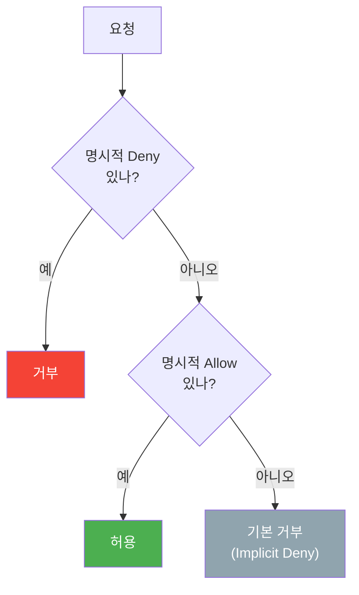
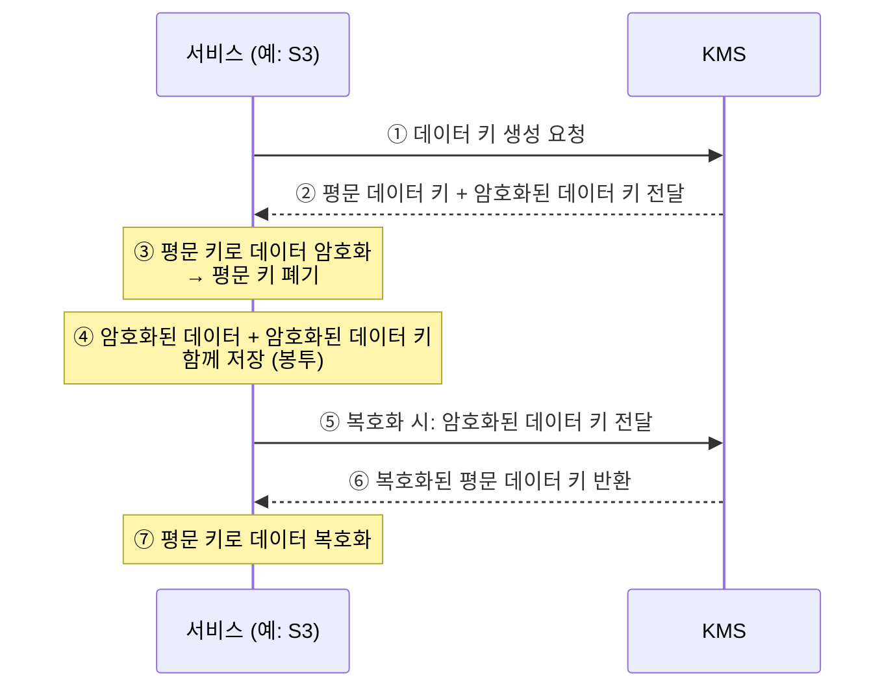
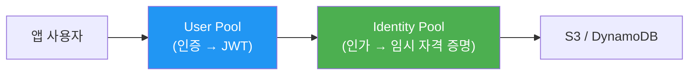

# W6. Security & Storage Gateway (IAM, KMS, ACM, Cognito, SGW, Shield)

---

## 0. 들어가기 전에 — 보안 서비스 지도

💡 6주차는 "누가 접근하나(인증·인가)", "데이터를 어떻게 숨기나(암호화·인증서)", "공격을 어떻게 막나(방화벽·DDoS)", "온프레미스와 어떻게 잇나(SGW·DataSync)"의 네 갈래다. 시험은 시나리오 단서로 어느 서비스인지 묻는다.

| 갈래 | 서비스 | 한 줄 역할 |
|----|------|--------|
| 인증·인가 | IAM | AWS 리소스 접근 권한 제어 (내부 사용자·서비스) |
| 앱 사용자 인증 | Cognito | 웹/모바일 앱의 로그인·회원 관리 (외부 최종 사용자) |
| 암호화 | KMS | 암·복호화 키 생성·관리 |
| 인증서 | ACM | SSL/TLS 인증서 발급·관리 (무료) |
| 공격 방어 | Shield / WAF / Network Firewall | DDoS·웹 공격·VPC 트래픽 차단 |
| 온프레 연계 | Storage Gateway / DataSync | 온프레미스 ↔ AWS 스토리지 연결·이전 |

---

## 1. IAM (Identity and Access Management)

### 1.1 IAM이란?

💡 AWS 계정 하나를 여러 사람·애플리케이션이 같이 쓸 때, "누가 무엇을 할 수 있는지"를 통제하지 않으면 사고가 난다. IAM은 사용자·서비스마다 필요한 권한만 정밀하게 부여하는 접근 제어 서비스. (IAM Role을 EC2에 붙이는 기본은 1주차 참고)

- AWS 리소스 접근을 인증(Authentication)·인가(Authorization)로 제어
- 구성 요소: User, Group, Role, Policy
- 💡 글로벌 서비스 — User·Role을 한 번 만들면 모든 Region에서 그대로 동작 (EC2·VPC처럼 Region마다 다시 만들 필요 없음)

### 1.2 User / Group / Role

| 요소 | 무엇인가 | 언제 쓰나 |
|----|--------|--------|
| User | 사람·앱 하나에 대응하는 자격 증명 (콘솔 로그인 / 프로그래밍 액세스) | 개별 직원·서비스 계정 |
| Group | User들의 묶음 + 권한 일괄 부여 | 부서·역할 단위 권한 관리 |
| Role | 권한 묶음을 가진 자격 증명. 고정 Access Key가 없고, 맡을(assume) 때마다 만료형 임시 자격 증명을 발급받아 사용 | EC2·Lambda 등 AWS 서비스, 외부 자격 증명 사용자, 교차 계정 접근 |

- 💡 "임시"의 뜻 — Role을 맡으면(assume) STS가 일정 시간(기본 1시간, 설정 가능) 뒤 만료되는 단기 자격 증명을 발급. 1회용이 아니라, 만료 전 자동으로 새 자격 증명으로 교체되므로 EC2 앱은 끊김 없이 계속 사용. 고정 키가 없어 유출돼도 곧 만료돼 안전한 게 핵심
- 💡 Role의 핵심 = Access Key를 코드에 박지 않고 권한 위임. EC2에 Role을 붙이면 그 안의 앱이 키 없이 S3 등에 접근 (1주차 참고)
- 신규 User는 처음엔 권한이 전혀 없음. Access Key / Secret Access Key는 생성 시 1회만 표시되니 즉시 보관
- User의 로그인 수단(비밀번호·Access Key)은 유출되면 그대로 뚫린다. 이 로그인을 한 겹 더 막는 장치가 MFA
  - 💡 MFA (Multi-Factor Authentication, 다중 인증): 비밀번호(아는 것)에 더해 OTP(One-Time Password, 일회용 비밀번호) 앱·하드웨어 토큰 같은 "가진 것"을 한 번 더 요구하는 이중 인증. 비밀번호가 유출돼도 두 번째 요소가 없으면 로그인 불가 → 루트 계정·중요 User에 켜는 게 권장 (S3의 MFA Delete는 2주차 참고)

> 💡 시험 단서: "EC2/Lambda가 다른 AWS 서비스에 접근" → **IAM Role** (Access Key를 인스턴스에 넣지 말 것)

### 1.3 정책(Policy) — JSON 구조

💡 정책은 "권한의 범위"를 적은 JSON 문서. User·Group·Role에 붙여 무엇을 허용/거부할지 정의. AWS가 미리 만든 관리형 정책(예: AmazonS3FullAccess)을 붙이거나 직접 작성.

JSON 5대 구성 요소:

| 요소 | 의미 | 예 |
|----|----|---|
| Effect | 허용/거부 | `Allow` / `Deny` |
| Principal | 대상(누구) | 특정 계정·Role (리소스 기반 정책에서) |
| Action | 작업 종류 | `s3:GetObject`, `s3:PutObject` |
| Resource | 적용 대상 리소스 | 특정 버킷 ARN(Amazon Resource Name, AWS 리소스 고유 식별자) |
| Condition | 조건 | 특정 IP·MFA·VPC Endpoint일 때만 (2주차 정책 예시 참고) |

### 1.4 정책 평가 로직 (시험 빈출)

💡 권한이 여러 곳에서 겹칠 때 무엇이 이기는지가 시험 단골. 규칙: 명시적 거부(Explicit Deny)가 항상 최우선.

- 기본은 모두 거부(Implicit Deny). Allow가 하나라도 있어야 허용
- 단, 어디서든 Deny가 하나라도 있으면 무조건 거부 — Allow가 있어도 Deny가 이김

> 💡 시험 단서: "Allow와 Deny가 동시에 걸린 사용자의 결과" → **거부** (Explicit Deny 우선)

### 1.5 IAM 핵심 시험 포인트

| 시나리오 | 정답 |
|--------|----|
| EC2 앱이 S3 접근, 키를 안 박고 싶음 | IAM Role |
| 부서 단위로 권한 일괄 관리 | Group |
| 로그인 추가 보호 | MFA |
| Allow + Deny 충돌 결과 | Deny 우선 |
| 특정 IP에서만 / MFA 했을 때만 허용 | Policy Condition |

---

## 2. KMS (Key Management Service)

### 2.1 KMS란?

💡 데이터를 암호화하려면 "키"가 필요한데, 그 키를 어디에 안전하게 보관하고 누가 쓰게 할지가 어렵다. KMS는 암·복호화 키를 AWS가 안전하게 생성·관리해주는 서비스. EBS·S3·RDS·EFS 등 대부분의 AWS 서비스 암호화가 KMS를 사용. (S3의 SSE-KMS 사용은 2주차 참고)

- 키 유출 위험을 줄이고 키 사용 내역을 CloudTrail에 감사 기록으로 남김
- KMS Key(예전 이름 CMK, Customer Master Key): 데이터를 직접 암호화하는 "데이터 키"를 만들어내는 상위 키

### 2.2 봉투 암호화 (Envelope Encryption)

💡 큰 데이터를 KMS Key로 직접 암호화하지 않는다. 대신 KMS Key로 데이터 키를 암호화하고, 그 데이터 키로 실제 데이터를 암호화하는 2단 구조 — 이를 봉투 암호화라 부른다. 왜? KMS로 직접 큰 데이터를 보내면 느리고 크기 제한이 있어서.

- 핵심: 평문 데이터 키는 암호화 직후 메모리에서 폐기 → 저장되는 건 "암호화된 데이터 키"뿐이라 안전

### 2.3 키 유형 3가지

| 유형 | 누가 관리 | 특징 |
|----|--------|----|
| AWS 관리형 키 | AWS | 사용자가 제어 불가, AWS가 1년 주기 자동 교체. 암호화를 켜기만 하면 기본 사용됨 |
| 고객 관리형 키 | 고객 | 활성화·비활성화·삭제·교체·키 정책(누가 쓸지) 직접 제어 |
| 사용자 지정 키 스토어 | 고객(CloudHSM) | 키를 KMS가 아닌 CloudHSM(전용 하드웨어 보안 모듈)에 보관. 규정상 키를 전용 HW에 둬야 할 때 |

- 💡 고객 관리형 키를 쓰는 이유: 키 교체 주기·접근 권한을 직접 통제하고, 키 삭제로 데이터를 영구 접근 불가하게 만들 수 있음 (규정 준수)

> 💡 시험 단서: "키를 직접 제어·삭제·접근 권한 지정" → 고객 관리형 키 / "전용 하드웨어에 키 보관 규정" → CloudHSM 키 스토어

### 2.4 KMS 핵심 시험 포인트

| 시나리오 | 정답 |
|--------|----|
| 키 사용 감사 기록 필요 | KMS (CloudTrail 기록) + S3는 SSE-KMS |
| 키 교체·삭제·권한을 직접 통제 | 고객 관리형 키 |
| 전용 HW에 키 보관 규정 | CloudHSM 키 스토어 |
| 큰 데이터 효율적 암호화 방식 | 봉투 암호화 (데이터 키 2단 구조) |

---

## 3. ACM (AWS Certificate Manager)

### 3.1 ACM이란?

💡 HTTPS를 쓰려면 SSL/TLS 인증서가 필요한데, 직접 사면 비용이 들고 만료될 때마다 수동 갱신해야 한다. ACM은 인증서를 무료로 발급하고 자동 갱신해주는 서비스. (CloudFront·ALB에서의 사용은 4주차 참고)

- AWS가 발급한 인증서 또는 외부(서드파티) 인증서를 가져와 AWS 서비스에 연결
- 적용 가능: ELB, CloudFront, API Gateway, Cognito, CloudFormation 등
- 💡 CloudFront에 쓸 인증서는 반드시 us-east-1(버지니아 북부)에서 발급 — CloudFront가 글로벌 서비스라서 (2주차·4주차에서 다룬 핵심 함정)

### 3.2 도메인 소유 검증 (DNS vs Email)

💡 인증서를 받으려면 "이 도메인이 정말 당신 것"임을 증명해야 한다. 두 가지 방식:

| 방식 | 동작 | 특징 |
|----|----|----|
| DNS 검증 | ACM이 요구하는 CNAME 레코드를 도메인에 추가 | 💡 자동 갱신에 유리 (레코드 유지 시 갱신 자동) — 권장 |
| Email 검증 | 도메인 등록 관리자(WHOIS) 이메일로 승인 | 사람이 매번 클릭해야 해 갱신 번거로움 |

> 💡 시험 단서: "인증서 자동 갱신" → **DNS 검증** / "Route 53 사용 중 도메인 검증" → DNS 검증(CNAME 자동 추가)

### 3.3 ACM 핵심 시험 포인트

| 시나리오 | 정답 |
|--------|----|
| HTTPS 인증서 무료 + 자동 갱신 | ACM + DNS 검증 |
| CloudFront용 인증서 발급 리전 | us-east-1 |
| ALB에 HTTPS 적용 | ACM 인증서를 ALB에 연결 (SSL Offload, 4주차) |

---

## 4. Amazon Cognito

### 4.1 Cognito란?

💡 IAM이 "AWS 리소스를 다루는 내부 사용자·서비스"의 권한 관리라면, Cognito는 "내 웹/앱에 가입·로그인하는 수백만 최종 사용자"의 인증·회원 관리를 맡는다. 둘의 대상이 다르다.

- 웹/모바일 앱의 사용자 인증·권한 부여·회원 관리
- 소셜 로그인(Google·Facebook·Amazon), SAML(기업용 SSO 표준)·OpenID Connect(소셜·외부 로그인 표준) 같은 외부 자격 증명 공급자 연동
- 구성: User Pool + Identity Pool

### 4.2 User Pool vs Identity Pool (시험 빈출)

💡 이름이 비슷해 헷갈리지만 역할이 정반대다. User Pool = 인증(누구인지 확인), Identity Pool = 인가(AWS 리소스 접근 권한 부여).

| 구분 | User Pool (사용자 풀) | Identity Pool (자격 증명 풀) |
|----|------|--------|
| 역할 | 인증 (로그인·회원 디렉토리) | 인가 (AWS 리소스 임시 권한) |
| 결과물 | JWT(JSON Web Token) 발급 | AWS 임시 자격 증명(STS, Security Token Service) |
| 용도 | "이 사람이 맞는지 확인" | "로그인한 사람에게 S3·DynamoDB 접근권 부여" |
| 게스트 | — | 인증 안 된 게스트에게도 권한 부여 가능 |

> 💡 시험 단서:
> - "앱 로그인·회원 가입·소셜 로그인" → **User Pool**
> - "로그인한 사용자가 S3/DynamoDB에 직접 접근" → **Identity Pool**

### 4.3 Cognito 핵심 시험 포인트

| 시나리오 | 정답 |
|--------|----|
| 모바일 앱 회원가입·로그인·소셜 로그인 | Cognito User Pool |
| 로그인 사용자에게 AWS 리소스 임시 접근권 | Cognito Identity Pool |
| ALB가 코드 변경 없이 로그인 위임 | ALB + Cognito (4주차) |

---

## 5. Storage Gateway & DataSync

### 5.1 Storage Gateway란?

💡 온프레미스 서버가 AWS 클라우드 스토리지(주로 S3)를 마치 로컬 디스크처럼 쓰게 해주는 연결 다리. 이름이 "Gateway"인 건 스토리지 자체가 아니라 S3로 가는 입구 역할을 하기 때문. 표준 프로토콜(NFS·SMB·iSCSI — 아래 "파일 vs 블록" 참고)을 제공해 기존 앱 수정 없이 연결.

- 자주 쓰는 데이터는 게이트웨이의 로컬 캐시에 두어 빠르게 읽고, 원본은 S3에 보관
- 3종: File Gateway / Volume Gateway / Tape Gateway

💡 파일 프로토콜 vs 블록 프로토콜 (File GW와 Volume GW를 가르는 기준):
- NFS·SMB = 파일 단위. 서버가 폴더·파일을 보여주고 여러 클라이언트가 동시에 공유 (NFS=리눅스, SMB=윈도우 — 2주차 FSx 참고)
- iSCSI = 블록 단위. 네트워크 너머의 빈 디스크 하나를 내 컴퓨터에 꽂은 것처럼 인식시켜, 그 위에 내가 직접 파일시스템을 올려 단독 사용 (외장하드 느낌)
- 그래서 File Gateway(파일) → NFS·SMB / Volume Gateway(블록) → iSCSI

💡 게이트웨이를 어떻게 두나 (배포 방식): Storage Gateway는 관리형 서비스지만 "게이트웨이" 본체는 내 온프레미스에 직접 띄워야 한다. 막연한 "다리"가 아니라 실제로는 내 서버실에 도는 소프트웨어 한 대.

- VM 이미지를 받아 VMware ESXi·Microsoft Hyper-V·Linux KVM에 설치 (가장 일반적. 소프트웨어 자체는 무료 — 실제 비용은 S3 저장·전송량)
- 가상화 인프라가 없으면 AWS가 파는 전용 하드웨어 장비(Storage Gateway Hardware Appliance)를 구매해 사용
- 클라우드 내 용도면 EC2 인스턴스로도 실행 가능
- 설치 후 AWS 콘솔에서 그 게이트웨이를 내 계정에 활성화(activate)하면 S3 등과 연결됨

### 5.2 File Gateway / FSx File Gateway

- File Gateway: NFS·SMB로 S3에 파일을 객체로 저장·조회. S3에 객체로 보이므로 Lifecycle·버전 관리 등 S3 기능 활용 가능. 자주 쓰는 파일은 로컬 캐시
- FSx File Gateway: SMB로 FSx for Windows File Server에 접근. FSx가 SMB를 직접 지원해도 게이트웨이를 두는 이유는 💡 빈번한 접근 데이터를 로컬 캐시로 빠르게 쓰기 위함 (FSx 정의는 2주차 참고)

### 5.3 Volume Gateway (Cached vs Stored)

💡 파일이 아니라 블록 스토리지(iSCSI)를 S3에 EBS 스냅샷 형태로 저장. "주 데이터가 어디 있느냐"로 두 유형이 갈린다.

| 유형 | 주 데이터 위치 | 동작 |
|----|----------|----|
| Cached Volume | S3 (클라우드) | 자주 쓰는 것만 온프레 캐시. 저장 용량 절감 |
| Stored Volume | 온프레미스 | 전체를 로컬에 두고 S3로 비동기 백업(스냅샷) |

- 💡 File Gateway와 달리 S3 안에서 데이터를 파일로 직접 볼 수 없음 — 디스크 전체를 블록 단위로 떠서 "디스크 이미지 덩어리(EBS 스냅샷)"로 저장하기 때문. S3는 그게 무슨 파일들인지 모름 (봉인된 외장하드 같은 상태). File Gateway는 파일 1개=S3 객체 1개라 S3에서 그대로 보이는 것과 대비
- 💡 그럼 온프레에선 어떻게 보나? 게이트웨이가 그 볼륨을 iSCSI로 온프레 서버에 디스크처럼 붙여주면(mount), OS 파일시스템이 블록을 해석해 평소처럼 폴더·파일로 보임 (외장하드를 PC에 꽂으면 내용이 보이는 것과 같음). Stored는 재해 시 스냅샷을 복원해 사용

> 💡 시험 단서: "로컬 저장 공간 절약·주 데이터 클라우드" → Cached / "주 데이터는 온프레, 백업만 클라우드" → Stored

### 5.4 Tape Gateway

💡 테이프(자기 테이프)란? 기업이 예전부터 장기 백업·아카이브에 쓰던 저장 매체. 카세트테이프처럼 생긴 카트리지(LTO 규격)에 순차 기록 — GB당 매우 싸고 수십 년 보관 가능하지만 느린 오프라인 매체. 백업 소프트웨어(Veeam·NetBackup 등)가 테이프 라이브러리(카트리지를 로봇팔로 갈아끼우는 장비)에 데이터를 구움. 물리 카트리지·장비·보관·외부 반출 관리가 번거로운 게 단점.

- 기존 테이프 백업 장비·소프트웨어를 그대로 쓰면서, 가상 테이프 라이브러리(VTL, Virtual Tape Library)를 S3/S3 Glacier에 저장
- 즉 백업 소프트웨어에는 진짜 테이프 장비(VTL)인 척 보여주되 실제 데이터는 S3/Glacier로 → 소프트웨어·절차는 그대로 두고 물리 테이프만 클라우드로 대체
- 💡 시험 단서: "기존 테이프 백업 인프라를 클라우드로 / 장기 백업 아카이브" → **Tape Gateway**

### 5.5 AWS DataSync

💡 Storage Gateway가 "상시 연결해 쓰는 다리"라면, DataSync는 "데이터를 한 번에 대량으로 옮기는 이사 트럭". 온프레미스 → AWS, 또는 AWS 스토리지 간 데이터를 빠르게 복제·이전. (2주차에서 EFS 암호화 변경·Snowcone 맥락에서 언급)

- Direct Connect·VPN·인터넷으로 전송, DataSync Agent가 데이터를 옮김
- 대상: S3, EFS, FSx(Windows/Lustre/OpenZFS/NetApp ONTAP) 등 — AWS 서비스 간 이동도 지원
- 💡 증분 전송·검증·스케줄링 지원 → 일회성 마이그레이션 또는 주기적 동기화에 적합

### 5.6 Storage Gateway vs DataSync 시험 포인트

| 시나리오 | 정답 |
|--------|----|
| 온프레가 S3를 로컬처럼 상시 사용(NFS/SMB) | File Gateway |
| 온프레 블록 볼륨을 S3에 백업 | Volume Gateway |
| 기존 테이프 백업을 클라우드로 | Tape Gateway |
| 온프레 → AWS 대량 데이터 일괄 이전·동기화 | DataSync |
| 네트워크 없이 페타바이트 물리 이전 | Snow Family (2주차) |

---

## 6. Shield & WAF & Network Firewall

💡 Shield(DDoS)와 WAF(웹 공격)는 4주차 1.7에서 상세히 다뤘다. 여기서는 핵심만 짚고, 4주차에 없던 Network Firewall과 셋의 차이에 집중한다.

### 6.1 Shield / WAF 요약 (상세는 4주차 1.7)

- Shield Standard: L3/L4 DDoS(Distributed Denial of Service, 분산 서비스 거부 — 다수의 좀비 PC로 트래픽을 폭주시켜 서비스를 마비시키는 공격) 자동 방어. 모든 계정에 무료·기본 활성
- Shield Advanced: 유료, 정교한 DDoS 방어 + SRT(Shield Response Team) 전문가 지원 + 요금 보호. 보호 대상 확장(ELB·CloudFront·Route 53·Global Accelerator)
- WAF: L7 웹 공격(SQLi·XSS·악성 봇·Rate 초과) 차단. CloudFront·ALB·API Gateway에 연결

### 6.2 Network Firewall

💡 WAF가 웹(HTTP) 공격을 막고 Shield가 DDoS를 막는다면, Network Firewall은 VPC 전체의 네트워크 트래픽을 IP·포트·프로토콜·도메인 단위로 검사·차단하는 관리형 방화벽. VPC로 드나드는 모든 트래픽이 대상이라 범위가 가장 넓다.

- IP·포트·프로토콜·도메인 기반 허용/차단
- 두 가지 규칙 엔진:
  - 상태 저장(Stateful): 통과한 연결을 기억해 응답 트래픽을 자동 허용
  - 상태 비저장(Stateless): 기억 없이 In/Out 패킷을 각각 검사
- AWS 관리형 규칙 그룹 + 직접 만든 규칙 사용 가능. 직접 만들 때는 Suricata 형식으로 작성 — Suricata는 업계 표준 오픈소스 IPS(Intrusion Prevention System, 침입 방지 시스템) 엔진으로, 그 규칙 문법을 그대로 쓸 수 있다는 뜻 (이미 Suricata 룰을 쓰던 곳이면 그대로 이전 가능)

### 6.3 셋의 차이 — 시험 판별

| 서비스 | 계층/범위 | 막는 것 | 붙는 위치 |
|------|--------|------|--------|
| Shield | L3/L4 (+Advanced는 L7 모니터링) | DDoS | CloudFront·ELB·Route 53·GA 등 |
| WAF | L7 (HTTP) | SQLi·XSS·봇·Rate 초과 | CloudFront·ALB·API Gateway |
| Network Firewall | VPC 전체 (L3~L7) | VPC 인/아웃 트래픽 전반 | VPC |

> 💡 시험 단서:
> - "DDoS 자동/고급 방어" → **Shield (Standard/Advanced)**
> - "웹 애플리케이션 공격(SQLi/XSS) 차단" → **WAF**
> - "VPC 전체 트래픽을 IP·도메인·프로토콜로 통제" → **Network Firewall**

---

## 7. 핵심 요약 & 시험 포인트

### IAM 핵심
- 글로벌 접근 제어. User / Group / Role / Policy
- Role = 키 없이 임시 권한 위임 (EC2·Lambda·교차 계정) — 시험 핵심
- Policy JSON: Effect·Principal·Action·Resource·Condition
- 평가: 기본 거부, Allow 필요, Explicit Deny가 항상 최우선

### KMS 핵심
- 암·복호화 키 관리, CloudTrail 감사 기록
- 봉투 암호화: KMS Key가 데이터 키를 암호화, 데이터 키가 실제 데이터를 암호화
- 키 유형: AWS 관리형 / 고객 관리형(직접 제어·삭제) / CloudHSM 키 스토어

### ACM 핵심
- SSL/TLS 인증서 무료 발급·자동 갱신
- DNS 검증(자동 갱신 유리) vs Email 검증
- CloudFront용은 us-east-1에서 발급 (단골 함정)

### Cognito 핵심
- 앱 최종 사용자 인증·회원 관리 (IAM은 AWS 내부 권한, Cognito는 앱 사용자)
- User Pool = 인증(JWT) / Identity Pool = 인가(AWS 임시 자격 증명)

### Storage Gateway & DataSync 핵심
- File GW(S3, NFS/SMB) / Volume GW(블록, iSCSI: Cached=클라우드 주, Stored=온프레 주) / Tape GW(테이프 백업)
- DataSync = 온프레↔AWS 대량 데이터 이전·동기화 (상시 연결은 SGW, 일괄 이전은 DataSync)

### Shield / WAF / Network Firewall 핵심 (Shield·WAF 상세는 4주차)
- Shield: DDoS (Standard 무료 / Advanced 유료·전문가)
- WAF: L7 웹 공격 (SQLi·XSS·봇·Rate)
- Network Firewall: VPC 전체 트래픽 (IP·포트·프로토콜·도메인)

### 💡 자주 헷갈리는 개념 한 줄 정리

| 개념 쌍 | 한 줄 차이 |
|------|--------|
| IAM vs Cognito | AWS 내부 사용자·서비스 권한 / 앱 최종 사용자 로그인 |
| User Pool vs Identity Pool | 인증(누구인지) / 인가(AWS 리소스 접근) |
| AWS 관리형 키 vs 고객 관리형 키 | AWS가 통제·자동 교체 / 고객이 제어·삭제 가능 |
| DNS 검증 vs Email 검증 | 자동 갱신 유리 / 사람이 매번 승인 |
| Cached vs Stored Volume | 주 데이터 클라우드(S3) / 주 데이터 온프레 |
| Storage Gateway vs DataSync | 상시 연결해 사용 / 대량 일괄 이전 |
| WAF vs Network Firewall | L7 웹 공격 / VPC 전체 네트워크 트래픽 |
| Shield Standard vs Advanced | 무료 자동 DDoS / 유료 고급 + 요금 보호 |
