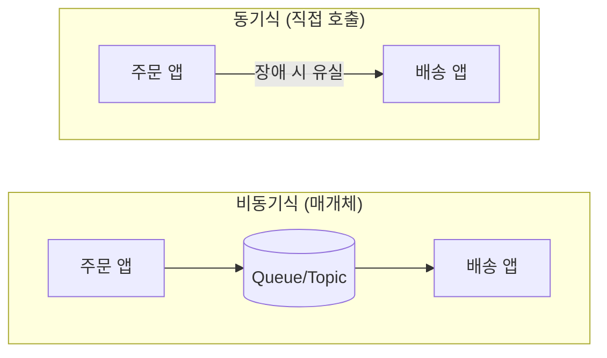
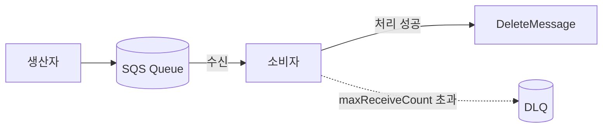
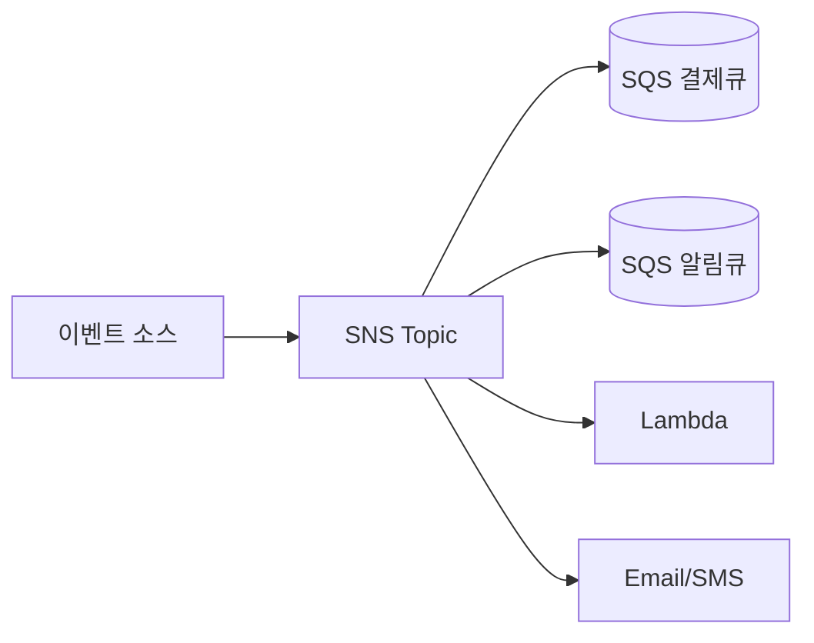
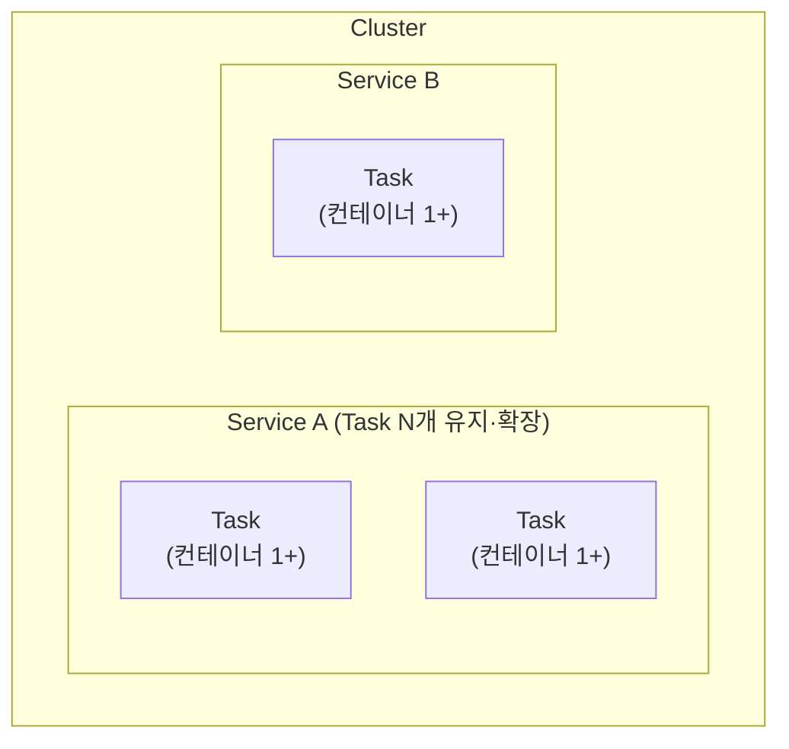

# W7. Messaging & Container (SQS, SNS, Kinesis, ECS, EKS)

---

## 0. 들어가기 전에 — 메시징 3형제 + 컨테이너

💡 7주차는 두 갈래다. 앞쪽은 "서비스끼리 어떻게 안전하게 데이터를 주고받나"(메시징 = SQS·SNS·Kinesis), 뒤쪽은 "그 서비스들을 어떻게 가볍게 띄우나"(컨테이너 = ECS·EKS). 시험은 시나리오 단서로 어느 것을 고를지 묻는다.

| 갈래 | 서비스 | 한 줄 역할 |
|----|------|--------|
| 작업 큐 | SQS | 생산자가 넣은 작업을 소비자가 꺼내 처리 (1:1, 비동기) |
| 발행·구독 | SNS | 한 번 발행한 메시지를 여러 구독자에게 동시 전달 (Fan-out) |
| 실시간 스트림 | Kinesis | 초당 대량 이벤트를 수집·저장하고 여러 소비자가 병렬로 읽음 |
| 컨테이너 관리 | ECS | AWS 자체 방식으로 컨테이너 실행·관리 |
| 컨테이너 관리 | EKS | Kubernetes 표준 방식으로 컨테이너 실행·관리 |

---

## 1. Messaging — 왜 필요한가

💡 주문 앱과 배송 앱이 서로 직접 호출하면, 배송 앱이 잠시 죽거나 느릴 때 주문 앱이 보낸 데이터가 그대로 유실된다. 둘 사이에 매개체(큐·Topic)를 두면, 한쪽이 멈춰도 메시지는 매개체에 쌓여 있다가 나중에 처리된다. 이렇게 서비스 간 의존을 끊는 것이 Decoupling이다.

- 동기식 통신: 두 앱이 직접 주고받음 → 한쪽 장애가 다른 쪽으로 전파
- 비동기식 통신: 매개체를 두고 주고받음 → 장애 격리, 처리 속도 차이 흡수

세 서비스의 모델 구분 (시험의 출발점):

| 서비스 | 모델 | 한마디 |
|------|----|-----|
| SQS | Queue (Pull 모델) | 꺼내 쓰는 작업 대기열 |
| SNS | Publish/Subscribe | 한 번 발행, 여러 곳에 전파 |
| Kinesis | Real-time Streaming | 대량 실시간 데이터 스트림 |

---

## 2. SQS (Simple Queue Service)

### 2.1 SQS란?

💡 생산자가 만든 메시지를 큐에 넣어두면, 소비자가 자기 속도로 하나씩 꺼내(Polling, 가져오기) 처리한다. 소비자가 잠시 바빠도 메시지는 보존 기간(기본 4일, 최대 14일) 동안 큐에 남아 있어 유실되지 않는다 → 작업 분리와 부하 흡수에 쓰는 가장 기본 서비스. 단, 소비자가 이 보존 기간을 넘겨 처리 못 하면 메시지는 삭제됨(영구 보관 아님).

- Pull 모델: 소비자가 큐를 열어 메시지를 가져감 (SNS의 Push와 대비)
- 처리량·메시지 수 제한 거의 없음, 메시지 1건 최대 256KB
- 메시지 보존: 기본 4일, 최대 14일 (소비자가 늦어도 이 기간 큐에 남음)
- 동작 3단계: 생산자가 SendMessage로 큐에 저장 → 소비자가 메시지 수신·처리 → 소비자가 DeleteMessage로 삭제 (삭제해야 사라짐)

> 💡 시험 단서: "주문/작업 처리를 비동기로 분리해 한 인스턴스가 죽어도 작업이 유실되지 않게" → **SQS** (소비자는 큐 길이 기반으로 Auto Scaling)

### 2.2 Standard vs FIFO

SQS 큐는 Standard와 FIFO 두 종류가 있다. 소비자가 여러 개로 늘면 같은 메시지를 둘이 동시에 가져가 순서가 뒤섞이거나 중복 처리될 수 있는데, 이 순서·중복을 어떻게 다루느냐가 두 유형의 차이다.

| 구분 | Standard | FIFO (First-In-First-Out, 선입선출) |
|----|--------|-----|
| 순서 | 보장 안 됨 | 보낸 순서대로 수신 |
| 중복 | 적어도 한 번 (중복 가능) | 정확히 한 번 (중복 제거) |
| 처리량 | 사실상 무제한 | 초당 300건 (배치 시 3,000건) |
| 이름 | 자유 | 이름 끝에 `.fifo` 필수 |

- 💡 FIFO는 MessageGroupId(메시지 그룹 ID)별로 순서를 지킨다. 결제 ID를 그룹 ID로 쓰면 같은 결제의 메시지들이 순서대로 처리됨 (시험에서 "특정 ID 단위 순서 보장" 단서)

> 💡 시험 단서: "순서 보장 + 정확히 한 번(중복 불가)" → **FIFO** / "최대 처리량, 순서 무관" → **Standard**

### 2.3 Visibility Timeout · DLQ

#### Visibility Timeout (가시성 시간 제한)

💡 SQS에서 수신(ReceiveMessage)은 메시지를 삭제하지 않는다. 소비자가 가져가도 메시지는 큐에 그대로 남고, 다만 일정 시간 동안 다른 소비자에게 안 보이게 숨겨질 뿐 — 이 숨김 시간이 Visibility Timeout (기본 30초). 처리를 끝낸 소비자가 DeleteMessage를 호출해야 비로소 삭제된다. 처리 중인 메시지를 다른 소비자가 또 가져가 중복 처리하는 것을 막는 장치.

- 이 시간 안에 처리·삭제를 못 하면 메시지가 다시 보이게 되어 다른 소비자가 가져감 → 중복 발생 (소비자가 처리 중 죽어도 유실되지 않는 이유)
- 처리가 오래 걸리면 ChangeMessageVisibility로 시간을 늘려 중복을 막음

#### DLQ (Dead-Letter Queue, 처리 실패 메시지 격리 큐)

💡 어떤 메시지가 계속 처리에 실패하면(예: 형식 오류), 무한 재시도로 큐가 막힌다. 일정 횟수(maxReceiveCount) 넘게 실패한 메시지를 따로 빼두는 큐가 DLQ. 원인 분석·재처리를 별도로 할 수 있다.

- Redrive Policy로 "몇 번 실패하면 DLQ로 보낼지" 설정

> 💡 시험 단서: "처리에 반복 실패하는 메시지를 자동으로 격리" → **DLQ + Redrive Policy**

### 2.4 Long Polling · 배치 · Delay Queue

- Long Polling: 큐가 비었을 때 소비자가 메시지가 올 때까지 최대 20초 기다림 → 빈 응답에 따른 API 호출 횟수를 줄여 비용 절감 (Short Polling은 즉시 빈 응답 반환)
- 배치 API: SendMessageBatch / DeleteMessageBatch로 한 번에 최대 10건 처리 → 호출 비용 절감
- Delay Queue (지연 큐): 큐에 넣는 순간부터 일정 시간(최대 15분) 숨겼다가 그 뒤에 소비자에게 보이게 함 → 후속 처리를 일부러 늦춰야 할 때 (예: 주문 직후 취소 유예 시간을 두거나, DB 커밋·다른 시스템 반영이 끝난 뒤 처리되게). Visibility Timeout이 "수신 후" 숨김이면, Delay Queue는 "넣는 순간부터" 숨김
- 암호화: 전송 중은 HTTPS, 저장 시는 KMS로 암호화 (KMS는 6주차 참고). 접근 제어는 SQS 액세스 정책(리소스 기반) — 다른 계정에 큐 접근을 줄 때 IAM 대신 큐 정책 사용

---

## 3. SNS (Simple Notification Service)

### 3.1 SNS란?

💡 SQS는 한 메시지를 한 소비자가 꺼내 가지만, SNS는 한 번 발행한 메시지를 그 Topic을 구독한 모든 대상에게 동시에 밀어준다(Push). "주문 완료 시 → 이메일·SMS·결제 시스템에 한꺼번에 알림" 같은 발행·구독(Publish/Subscribe) 패턴에 쓴다.

- Topic (주제): 메시지의 분류 단위. 생산자(Publisher)는 Topic 하나에만 발행
- 구독자(Subscriber) 유형: HTTP(S), 이메일, SMS, SQS, Lambda, Kinesis Data Firehose, 모바일 Push
- Push 모델: Topic에 발행하면 구독자에게 즉시 전달 (SQS의 Pull과 대비)
- FIFO Topic: SQS처럼 순서·중복 제거가 필요할 때. 단 구독 대상은 SQS FIFO만 가능
- Message Filtering: 구독별 필터 정책(JSON)으로 원하는 메시지만 받기

### 3.2 SNS + SQS Fan-out 패턴

💡 생산자가 여러 SQS 큐에 같은 메시지를 직접 하나씩 보내면, 도중에 일부 전송이 실패해 누락될 수 있다. 대신 SNS Topic 하나에 발행하고 그 Topic을 여러 SQS 큐가 구독하면, 한 번 발행으로 모든 큐에 안전하게 전달된다. 이것이 Fan-out (한 번 발행, 여러 곳으로 부채살처럼 퍼짐).

- 각 SQS 큐가 메시지를 받아두므로, 소비자가 잠시 죽어도 유실 없음 (큐의 버퍼 효과)
- 구현 시 SNS가 SQS에 쓸 수 있도록 허용하는 권한 필요 (IAM은 6주차 참고)
- 예: S3 Event(이벤트 1개) → SNS Topic → 결제 큐·알림 큐·추천 큐 동시 전달 (S3 Event는 2주차 참고)

> 💡 시험 단서: "한 이벤트를 이메일·SMS·Lambda·여러 SQS에 동시에 + 소비자 장애에도 유실 없이" → **SNS → SQS Fan-out**

### 3.3 SQS vs SNS vs EventBridge

세 서비스 모두 서비스 간 의존을 끊는 Decoupling 용도지만, 떼어놓는 방식과 메시지 전달 모델이 다르다 (EventBridge는 3주차 참고).

| 구분 | SQS | SNS | EventBridge |
|----|----|----|----|
| 모델 | 풀 큐 | Pub/Sub Fan-out | 이벤트 버스 + 규칙 |
| 소비자 | 보통 1 | 다수 (구독자) | 다수 (규칙별 타겟) |
| 라우팅 | 단일 큐 | 구독 필터 | JSON 패턴 매칭 |
| 대표 사례 | 작업 큐 | 알림 Fan-out | 외부 서비스(SaaS)·AWS 이벤트 라우팅 |

> 💡 한마디 (셋 다 Decoupling 수단, 차이는 전달 방식): 작업 큐로 한 소비자가 처리=SQS / 즉시 다중 전파(Fan-out)=SNS / 다양한 소스 이벤트를 규칙으로 라우팅=EventBridge

---

## 4. Kinesis

### 4.1 Kinesis 제품군

💡 SQS·SNS는 건당 메시지를 다루지만, Kinesis는 초당 수만~수백만 건씩 쏟아지는 실시간 스트림(클릭 로그, IoT 센서, 동영상)을 수집·저장·분석하는 데 특화돼 있다. 여러 소비자가 같은 데이터를 병렬로 읽을 수 있는 게 큐와 다른 점.

| 서비스 | 성격 | 대표 용도 |
|------|----|--------|
| Kinesis Data Streams (KDS) | 수평 확장 스트림 | 실시간 수집·저장, 다수 소비자 |
| Kinesis Data Firehose | 코드 없이 목적지로 자동 적재 | S3·Redshift·OpenSearch 자동 적재 |
| Kinesis Data Analytics | 스트리밍 분석 | 실시간 집계·분석 (SQL/Python/Scala) |
| Kinesis Video Streams | 영상 스트림 | 카메라·CCTV |

(시험은 주로 "Data" 3종에서 출제)

### 4.2 Kinesis Data Streams (KDS)

💡 생산자가 데이터를 Push해 스트림에 쌓으면, 소비자(Lambda·EC2 앱·Firehose 등)가 그 데이터를 읽어 처리한다. 큐와 달리 읽어도 데이터가 사라지지 않아(보존 기간 동안 유지) 여러 소비자가 같은 데이터를 따로 처리할 수 있다.

용어:

| 용어 | 의미 |
|----|----|
| Data Record | 스트림에 저장되는 데이터 한 건 |
| Shard | 스트림을 나누는 구획(= Kafka 파티션). 레코드를 순서대로 담음. 칸마다 처리 용량이 고정 → Shard를 늘리면 전체 처리량 증가 |
| Partition Key | 레코드를 어느 Shard로 보낼지 정하는 키. 같은 파티션 키는 같은 Shard → 순서 보장 |
| 보존 기간 | 기본 24시간, 최대 365일 |

- 💡 결제 ID를 파티션 키로 쓰면 그 결제의 레코드가 한 Shard에 모여 순서대로 처리됨 (SQS FIFO의 MessageGroupId와 같은 발상)
- 처리량이 부족해 데이터가 누락되면 → Shard 수를 늘림 (시험 단서)
- 데이터가 S3에 다 안 들어오면 → 보존 기간을 소비·적재 주기보다 길게 (시험 단서)

> 💡 시험 단서: "IoT 센서 수만 대, 초당 수백만 이벤트, 다수 소비자 병렬, 실시간 분석" → **Kinesis Data Streams**

### 4.3 Kinesis Data Firehose

💡 KDS는 소비자 코드를 직접 짜서 읽어야 하지만, Firehose는 코드 없이 스트림 데이터를 S3·Redshift·OpenSearch 등으로 자동 배달해주는 완전 관리 서비스. 도중에 데이터 변환(Lambda)·압축·포맷 변환도 가능.

- 전송 대상: S3, Redshift, OpenSearch 등
- 서버·Shard 관리 불필요 (완전 관리)

> 💡 시험 단서: "스트림 데이터를 코드 없이 S3/Redshift/OpenSearch로 서버리스 배달" → **Kinesis Data Firehose**

### 4.4 Kinesis Data Analytics · MSK

- Kinesis Data Analytics: Data Streams·Firehose에서 받은 데이터를 SQL/Python/Scala로 실시간 집계·분석. "스트리밍 SQL로 실시간 분석" 단서
- 💡 Amazon MSK (Managed Streaming for Apache Kafka, 관리형 Kafka): 기존 Apache Kafka(오픈소스 분산 스트리밍 플랫폼)를 그대로 쓰고 싶을 때. "기존 Kafka 코드·생태계 유지하며 마이그레이션" 단서면 KDS가 아니라 MSK

#### KDS vs SQS vs Firehose 정리

| 요구 | 선택 |
|----|----|
| 작업 큐, 단일 소비자 그룹 | SQS |
| 순서·장기 보존·다수 소비자 병렬 읽기 | KDS |
| 코드 없이 S3/Redshift/OS 자동 적재 | Firehose |
| 기존 Kafka 그대로 | MSK |

> 💡 "KDS 하나면 다 되지 않나?" — 아니다. KDS는 대량 스트림 전용이라, SQS·SNS가 하는 일을 대체하면 더 비싸거나 아예 안 된다:
> - 이메일·SMS·Lambda로 즉시 알림(push) → KDS는 소비자가 읽어가는 pull이라 불가 → SNS
> - 작업을 하나씩 처리하고 치우기(개별 삭제·DLQ·재시도) → KDS엔 없는 작업 큐 기능 → SQS
> - KDS는 Shard 프로비저닝·시간당 과금 → 적거나 불규칙한 트래픽엔 과하고 비쌈
> - KDS는 "초당 대량 + 재생(replay) + 다수 독립 소비자"일 때만 제값을 함

---

## 5. 컨테이너 기초 (VM vs Container)

💡 마이크로서비스가 많아지면 "내 PC에선 되는데 서버에선 안 되는" 환경 차이 문제가 커진다. 앱과 실행에 필요한 라이브러리·설정을 한 패키지로 묶어 어디서든 똑같이 띄우는 것이 컨테이너. ECS·EKS를 이해하려면 이 기초가 먼저 필요하다.

컨테이너가 무엇인지는 기존 가상화 방식인 VM (Virtual Machine, 가상 머신)과 비교하면 가장 선명하다. 핵심은 "무엇을 가상화하느냐"다 — VM은 하드웨어를, 컨테이너는 OS(실행 환경)를 가상화한다. 컨테이너는 호스트의 OS 커널을 공유하면서 그 위에 앱·라이브러리만 격리해 돌린다.

| 구분 | VM | Container |
|----|----|----|
| 가상화 대상 | 하드웨어 (그 위에 게스트 OS 통째로 올림) | OS 실행 환경 (호스트 커널 공유, 프로세스만 격리) |
| OS(커널) 포함 | 포함 — 게스트 OS 통째로(커널까지) → 무겁고 느림 | 미포함 — 호스트 커널 공유(앱+라이브러리만) → 가볍고 빠름 |
| 격리 | 완전한 별도 OS | 호스트 OS 안에서 격리된 프로세스 |

- Docker: 컨테이너를 만들고 실행하는 대표 솔루션. 이미지(앱+필요 리소스를 묶은 최소 단위)를 기반으로 컨테이너를 띄움 → 이미지만 있으면 언제 어디서나 동일한 컨테이너 재현
- 💡 컨테이너가 많아지면 어디에 몇 개 띄울지, 죽으면 어떻게 살릴지 자동 관리가 필요 → 이 자동 관리를 Orchestration이라 하고, ECS·EKS가 그 역할

---

## 6. ECS (Elastic Container Service)

### 6.1 ECS란?

💡 AWS가 자체 방식으로 만든 컨테이너 Orchestration 서비스. Kubernetes를 모르는 팀도 쉽게 컨테이너를 띄울 수 있어 배우기 쉽다.

ECS는 다음 구성 요소로 이루어지며, 포함 관계가 핵심이다 — Cluster 안에 여러 Service, 각 Service가 여러 Task, 각 Task 안에 컨테이너 1개 이상.

- Cluster: Service·Task가 돌아가는 최상위 논리적 묶음 (실행 환경 = EC2 또는 Fargate). 한 Cluster에 여러 Service
- Service: 하나의 장기 실행 애플리케이션(배포 단위) — 예: "결제 서비스". 같은 앱의 복제본인 Task를 여러 개 띄워 원하는 개수로 유지·확장하고, 죽으면 새로 띄움. Task만으론 일회성(실행 후 끝, 죽어도 안 살아남)이라 항상 떠 있어야 하는 앱에 Service가 필요. 한 Cluster에 여러 Service(결제·주문·알림 등)
- Task: Service가 띄우는 실행 단위. 컨테이너 1개 이상의 묶음. ECS 실행 최소 단위
- Task Definition: Task를 어떻게 띄울지 적은 설계도(이미지·CPU·메모리). Task는 이 설계도로 찍어냄 — 실행 객체가 아니라 템플릿
- (부가) ALB/NLB는 Service에 연결 → ECS가 그 Service의 Task들을 타겟으로 등록해 여러 Task(복제본)로 트래픽 분산. EFS를 붙여 Task 간 파일 공유 (ELB는 4주차, EFS는 2주차 참고)

### 6.2 EC2 vs Fargate (시작 유형)

ECS로 컨테이너를 띄울 때 그 컨테이너가 "어디서" 돌지를 정하는 2가지 방식.

| 시작 유형 | 무엇 | 언제 |
|--------|----|----|
| EC2 | 내가 EC2를 만들고 그 위에서 컨테이너 실행 (EC2 관리·패치 내 몫) | 인스턴스를 세밀하게 제어해야 할 때 |
| Fargate | 서버리스 — EC2 없이 AWS가 컨테이너를 대신 실행 (Task 단위 과금) | 인프라 관리 없이 컨테이너만 띄우고 싶을 때 |

> 💡 시험 단서: "컨테이너를 실행하되 EC2/Cluster를 관리하고 싶지 않다, 운영 오버헤드 최소" → **Fargate**

### 6.3 ECS의 IAM Role · ECR

컨테이너가 두 종류의 권한을 필요로 한다는 점이 시험 포인트 (IAM Role은 6주차 참고). 둘은 "언제·누가 쓰느냐"로 갈린다:

| Role | 언제 | 누가 쓰나 | 예 |
|----|----|--------|---|
| Execution Role | 앱 켜지기 전 (컨테이너 준비) | ECS 플랫폼 | ECR 이미지 받기, CloudWatch 로그 설정 |
| Task Role | 앱 켜진 후 (실행 중) | 내 앱 코드 | S3 읽기, DynamoDB 쓰기 |

- Task Role은 Task마다 다르게 줄 수 있음 (A Task엔 S3, B Task엔 DynamoDB 권한)

- 💡 ECR (Elastic Container Registry): 컨테이너 이미지를 저장하는 AWS의 비공개 저장소. Docker Hub의 AWS판. Inspector(AWS의 취약점 자동 점검 서비스)와 연동해 이미지 취약점 스캔 가능

> 💡 시험 단서: "컨테이너 이미지를 비공개로 저장 + 취약점 스캔" → **ECR (+ Inspector)**

---

## 7. EKS (Elastic Kubernetes Service)

### 7.1 Kubernetes 기초

💡 Kubernetes(K8s)는 컨테이너 배포·확장·관리를 자동화하는 오픈소스 Orchestration 도구. ECS가 AWS 전용이라면 K8s는 업계 표준이라, 여러 클라우드·기존 K8s 자산이 있는 조직이 선호한다.

| 구성 요소 | 역할 |
|--------|----|
| Cluster | K8s 배포 단위. Control Plane + Node로 구성 |
| Control Plane (Master) | Node·Pod를 관리·스케줄링하는 두뇌. kube-apiserver(API 창구)·etcd(상태 저장소) 등을 포함 |
| Node (Worker) | 실제 컨테이너가 도는 서버 |
| Pod | 실행 중인 컨테이너의 묶음. Node 위에서 실행되는 최소 배포 단위 |

방금 본 K8s 용어는 6장 ECS와 이렇게 대응한다:

| ECS | EKS(K8s) | 의미 |
|----|----|----|
| Cluster | Cluster | 전체 묶음 |
| Task | Pod | 컨테이너 1개+ 묶음, 실행 최소 단위 |
| Task Definition | Pod 정의(manifest) | 설계도 |
| Service | Deployment | Pod 복제본을 원하는 수만큼 유지·확장하는 K8s 객체 |
| Task Role | IRSA | 컨테이너 단위 IAM 권한 |
| EC2 / Fargate | Node 그룹 / Fargate | 컴퓨팅(어디서 돌릴지) |

⚠️ K8s에도 'Service' 객체가 있지만 ECS Service와 다름 — K8s Service는 네트워크 접속점(로드밸런싱)용이고, 복제본 유지는 Deployment가 함.

### 7.2 EKS란?

💡 Kubernetes를 직접 운영하려면 Control Plane을 깔고 관리해야 해서 부담이 크다. EKS는 AWS가 Control Plane을 대신 관리해주는 관리형 Kubernetes 서비스. 기존 K8s 설정 파일(manifest)·도구(Helm 등)를 그대로 쓸 수 있다.

ECS가 있는데 EKS를 왜 쓰나 — "AWS 전용이냐 / 업계 표준이냐"의 차이다:

| | ECS | EKS |
|--|----|----|
| 방식 | AWS 자체 방식 | Kubernetes(오픈소스 표준) |
| 장점 | 단순·배우기 쉬움·AWS와 매끄러운 통합 | 이식성(여러 클라우드·온프레미스), 기존 K8s 자산·도구(Helm 등) 재사용, 방대한 생태계 |
| 단점 | AWS에 종속(다른 데로 못 옮김) | K8s 자체가 복잡 → 운영 부담·학습 난도 큼 |

→ AWS만 쓰고 단순하게 = ECS / K8s 표준·이식성·기존 자산이 필요 = EKS

- Node 구성 — EKS에서 Pod를 실제로 어느 환경(컴퓨팅)에 띄울지 정하는 3가지 방식. 앞의 둘은 EC2 서버(Node = Pod가 도는 EC2 워커 서버)를 쓰고 "그 EC2를 누가 관리하느냐"만 다르며, 셋째는 EC2 자체가 없는 서버리스다:

| 방식 | 무엇인가 | 관리 부담 |
|----|--------|--------|
| 관리형 Node 그룹 | EKS용 EC2 워커 Node들을 AWS가 묶음으로 만들어 주고, 그 EC2의 생성·패치(AMI 업데이트)·스케일링까지 자동 관리 | 낮음 — EC2는 있지만 수명주기를 AWS가 관리 |
| 자체 관리형 Node | 내가 EC2를 직접 만들어 Cluster에 워커 Node로 등록하고, 패치·스케일링까지 전부 직접 함 | 높음 — 모두 내 몫(대신 최대 제어권) |
| Fargate | EC2 없이 AWS가 Pod를 서버리스로 실행 (Node라는 개념 자체가 없음) | 없음 — 관리할 Node가 없음 |

- Fargate 옵션으로 EKS를 돌리는 구성을 'EKS on Fargate'라 부름 — Node(EC2)가 없어 Node 관리도 불필요
- ALB/NLB 연결, EBS·EFS 스토리지 연동 가능
- 💡 IRSA (IAM Roles for Service Accounts): Pod별로 AWS 권한을 다르게 주는 방식. ServiceAccount(K8s 안에서 Pod의 신분증)를 IAM Role에 연결하면, 그 신분증을 단 Pod가 그 Role의 권한을 가짐. 예: order Pod엔 S3만, payment Pod엔 DynamoDB만. (없으면 한 Node의 모든 Pod가 Node 권한을 공유 = 과한 권한). ECS Task Role의 EKS판

#### EKS Auto Scaling

- 수평 Pod Autoscaler(HPA): CPU 등 부하에 따라 Pod 수 조정
- Cluster Autoscaler: Pod를 띄울 자리가 없을 때 Node 수를 조정. "Node가 최대 용량에 도달했는데 자동 확장이 안 됨" → Cluster Autoscaler 단서
- Karpenter: AWS가 만든 오픈소스 Autoscaler (필요 즉시 빠르게 Node 배포)

> 💡 시험 단서: "Kubernetes API·생태계 그대로 + AWS 관리형" → **EKS** / "EKS인데 Node 관리도 싫다" → **EKS on Fargate**

---

## 8. 핵심 요약 & 시험 포인트

### SQS 핵심
- Pull 모델 작업 큐. 메시지 256KB, 보존 기본 4일·최대 14일
- Standard(무제한·중복 가능) vs FIFO(순서·정확히 한 번, 초당 300/배치 3,000)
- Visibility Timeout = 처리 중 숨기기 / DLQ + Redrive = 반복 실패 격리
- Long Polling(최대 20초)으로 빈 응답 비용 절감 / 소비자는 큐 길이 기반 Auto Scaling

### SNS 핵심
- Pub/Sub Push. Topic + 구독자(Email·SMS·HTTP·Lambda·SQS·Firehose·Mobile)
- Fan-out 대표 패턴: SNS → 여러 SQS (한 번 발행, 각 소비자 독립 처리·유실 방지)
- FIFO Topic은 SQS FIFO만 구독 가능 / Message Filtering으로 구독별 선택

### Kinesis 핵심
- KDS = Shard 기반 실시간 스트림, 다수 소비자 병렬, 보존 24시간~365일
- 파티션 키로 Shard 분배·순서 보장 / 처리량 부족 → Shard 증설
- Firehose = 코드 없이 S3/Redshift/OpenSearch 자동 적재 (서버리스)
- 기존 Kafka → MSK

### 컨테이너 핵심
- ECS = AWS 자체 방식 / EKS = 관리형 Kubernetes
- EC2(직접 관리) vs Fargate(서버리스, Task 단위 과금)
- ECS Task Role(앱 권한) vs Execution Role(이미지 Pull·로그)
- ECR = 비공개 이미지 저장소(+ Inspector 스캔) / EKS IRSA = Pod 단위 IAM

### 💡 자주 헷갈리는 개념 한 줄 정리

| 개념 쌍 | 한 줄 차이 |
|------|--------|
| SQS vs SNS | 한 소비자가 꺼냄(Pull) / 여러 구독자에 발행(Push) |
| Standard vs FIFO | 무제한·중복 가능 / 순서·정확히 한 번 |
| Visibility Timeout vs DLQ | 처리 중 중복 방지 / 반복 실패 격리 |
| SNS vs EventBridge | 즉시 Fan-out / 규칙 기반 이벤트 라우팅 |
| KDS vs SQS | 다수 소비자·장기 보존 스트림 / 단일 소비자 작업 큐 |
| KDS vs Firehose | 직접 읽어 처리 / 코드 없이 자동 적재 |
| Kinesis vs MSK | AWS 네이티브 스트림 / 기존 Kafka 호환 |
| ECS vs EKS | AWS 자체·배우기 쉬움 / Kubernetes 표준·여러 클라우드 |
| EC2 vs Fargate | 인스턴스 직접 관리 / 서버리스 컨테이너 |
| Task Role vs Execution Role | 앱이 쓰는 권한 / 플랫폼이 쓰는 권한 |
